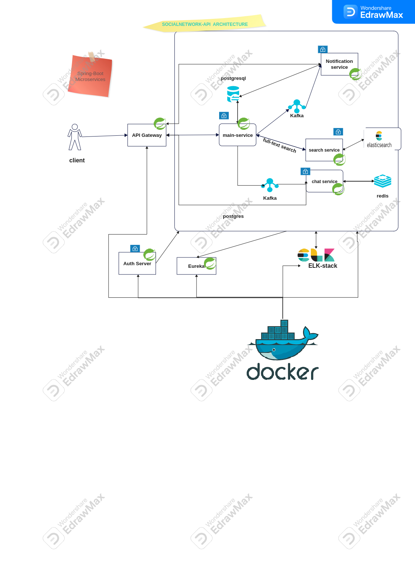
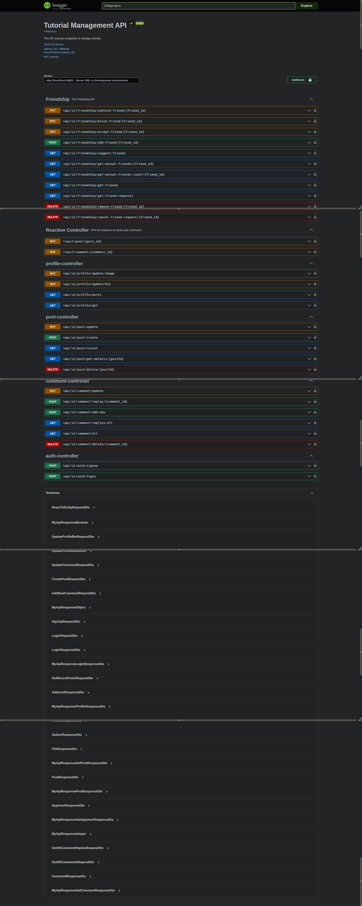

# spring boot (social-network) rest api (in-progress)

### ***Note***: ⛔️The system still under development, so some services may not work as expected.⛔️

This project is a microservice-based social network backend system built using Spring Boot. It provides a set of RESTful APIs for user authentication, profile management, post management, and comment management.
and provide full-text search using elasticsearch, and also provide a notification system using kafka, and also provide a chat system using websocket.
## Features
- [x] **User authentication (login, registration)**
- [x] User profile management (update profile picture, bio, skills)
- [x] User post management (create, view, update posts)
- [x] User comment management (create, view, update comments)
- [x] Full-text search using Elasticsearch
- [x] Notification system using Kafka
- [x] Chat system using Websocket
- [ ] Rate limiting using Redis
- [ ] Caching using Redis
- [ ] Logging using ELK stack (Elasticsearch, Logstash, Kibana)
    - [x] Setup ELK stack using Docker and Docker Compose
    - [ ] Setup Each service to log to ELK stack
- [x] Dockerized using Docker and Docker Compose
    - [ ] CI/CD using GitHub Actions
    - [x] ELK stack for logging
    - [x] kafka for message queuing
    - [x] Each service is a separate Docker container
    - [ ] Running on Docker Compose whole system
- [x] API documentation using Swagger
- [x] Security using Spring Security jwt
- [ ] Authentication and authorization using Keycloak

## Architecture
The system is designed using a microservice architecture, with each service responsible for a specific set of functionalities. The services communicate with each other using RESTful APIs and message queues. The architecture consists of the following services:

- [x] **Main Service**: The core service responsible for user authentication, registration, and managing user profiles, posts, and comments.
- [x] **Search Service**: Responsible for full-text search using Elasticsearch.
- [x] **Notification Service**: Responsible for sending notifications using Kafka.
- [x] **Chat Service**: Responsible for chat functionality using Websocket.
- [ ] **Gateway Service**: Responsible for routing requests to the appropriate services.
- [ ] **Config Service**: Responsible for managing configuration properties.
- [ ] **Discovery Service**: Responsible for service discovery using Eureka.
- [ ] **Monitoring Service**: Responsible for monitoring using Spring Boot Actuator.
- [ ] **Logging Service**: Responsible for logging using ELK stack.
- [ ] **Security Service**: Responsible for security using Spring Security Keycloak.
- [ ] **Load Balancer Service**: Responsible for load balancing using Nginx.
- [ ] **Rate Limiting Service**: Responsible for rate limiting using Redis.
- [ ] **Caching Service**: Responsible for caching using Redis.
- [x] **API Documentation Service**: Responsible for API documentation using Swagger.
- [ ] **Docker Service**: Responsible for containerization using Docker and Docker Compose.

The services are deployed as Docker containers and managed using Docker Compose. The system is designed to be scalable, fault-tolerant, and secure.

## Technologies
The system is built using the following technologies:

- [x] **Spring Boot**: For building microservices.
- [x] **Spring Data JPA**: For data access.
- [x] **Spring Security**: For security.
- [ ] **Spring Cloud**: For microservice architecture.
- [x] **Elasticsearch**: For full-text search.
- [x] **Kafka**: For message queuing.
- [x] **Websocket**: For real-time chat functionality.
- [x] **Redis**: For rate limiting and caching.
- [x] **ELK Stack**: For logging.
- [x] **Spring Boot Actuator**: For monitoring.
- [x] **Spring Security Keycloak**: For security.
- [x] **Nginx**: For load balancing.
- [x] **Resilience4j**: For circuit breaking.
- [x] **Swagger**: For API documentation.
- [x] **GitHub Actions**: For CI/CD.
- [x] **Docker**: For containerization.
- [x] **Docker Compose**: For managing containers.
- [x] **Java**: For programming language.
- [x] **Maven**: For dependency management.
- [x] **Git**: For version control.
- [x] **IntelliJ IDEA**: For IDE.
- [x] **Postman**: For API testing.
- [x] **Linux**: For operating system.
- [x] **Bash**: For shell scripting.
- [x] **Markdown**: For documentation.
- [x] **Draw.io**: For diagrams.
- [x] **Keycloak**: For identity and access management.
- [x] **Eureka**: For service discovery.
- [x] **Nginx**: For load balancing.
- [x] **Redis**: For rate limiting and caching.
- [x] **Swagger**: For API documentation.
- [x] **GitHub Actions**: For CI/CD using GitHub Actions.

## Services
The system consists of the following services:

- [x] **Main Service**: Responsible for user authentication and registration and handling user profile, post, and comment management.
- [x] **Search Service**: Responsible for full-text search using Elasticsearch.
- [x] **Notification Service**: Responsible for sending notifications using Kafka.
- [x] **Chat Service**: Responsible for chat functionality using Websocket.
   - what done:
     - [x] setup websocket server.
     - [x] connect to mongodb.
     - [x] handle tracking online users in-memory i.e.(leave, join)
     - [x] handle sending ,receiving messages.
   - TODO:
   - [ ] securing websocket connection.
   - [ ] handle authorization.
   - [ ] send messages offline.
- [ ] **Gateway Service**: Responsible for routing requests to the appropriate services.
- [ ] **Config Service**: Responsible for managing configuration properties.
- [ ] **Discovery Service**: Responsible for service discovery using Eureka.
- [ ] **Monitoring Service**: Responsible for monitoring using Spring Boot Actuator.
- [ ] **Logging Service**: Responsible for logging using ELK stack.
- [ ] **Security Service**: Responsible for security using Spring Security Keycloak.
- [ ] **Load Balancer Service**: Responsible for load balancing using Nginx.
- [ ] **Rate Limiting Service**: Responsible for rate limiting using Redis.
- [ ] **Caching Service**: Responsible for caching using Redis.
- [x] **API Documentation Service**: Responsible for API documentation using Swagger.
- [ ] **CI/CD Service**: Responsible for CI/CD using GitHub Actions.
- [ ] **Docker Service**: Responsible for containerization using Docker and Docker Compose.
- [ ] **Keycloak Service**: Responsible for identity and access management using Keycloak.
- [ ] **Eureka Service**: Responsible for service discovery using Eureka.

## Database Schema
The system uses the following database schema:


## Microservices Architecture



Overall, our backend system provides the necessary interfaces to create a full-featured social media platform. Our frontend developers can utilize these interfaces to create a seamless user experience, while our backend team ensures the reliability and scalability of the system.
### api documentation 


### Deployment Architecture
```plaintext
.
├── docker
│   ├── docker-compose-kafka.yml
│   ├── docker-dev-entrypoint.sh
│   └── elk-stack-docker
│       ├── docker-compose-elk.yml
│       └── logstash.conf
├── docker-compose-dev.yaml
├── docker-compose-prod.yaml
└── services
    ├── chat-service
    │   ├── docker
    │   │   └── dev
    │   │       ├── docker-compose.yml
    │   │       └── Dockerfile
    ├── discovery-service
    │   ├── docker
    │   │   └── dev
    │   │       ├── docker-compose.yml
    │   │       └── Dockerfile
    ├── gateway-service
    │   ├── docker
    │   │   └── dev
    │   │       ├── docker-compose.yml
    │   │       └── Dockerfile
    ├── main-service
    │   ├── docker
    │   │   ├── dev
    │   │   │   ├── docker-compose.yaml
    │   │   │   ├── Dockerfile.dev
    │   │   │   └── Dockerfile.dev.psql
    │   │   └── production
    │   │       ├── docker-compose-app-production.yaml
    │   │       ├── Dockerfile.production
    │   │       └── Dockerfile.production.psql
    ├── notification-service
    │   ├── docker
    │   │   └── dev
    │   │       ├── docker-compose.yml
    │   │       └── Dockerfile
    └── search-service
        ├── docker
        │   └── dev
        │       ├── docker-compose.yml
        │       └── Dockerfile

```
1. **Clone the repository**

2. **Open a terminal and go to the `docker` directory**
    ```bash
    cd docker
    ```

3. **Run the bash script to start all Docker containers automatically**  
   On **Linux/macOS**:
    ```bash
    chmod +x docker-dev-entrypoint.sh
    ./docker-dev-entrypoint.sh
    ```

   On **Windows (Git Bash or WSL)**:
    ```bash
    bash docker-dev-entrypoint.sh
    ```

---

### 🛠️ Notes
- Ensure Docker Engine and Docker Compose are installed and running.
- If you face permission issues, try:
    ```bash
    chmod +x docker-dev-entrypoint.sh
    ```
- Make sure the script uses **LF (Unix) line endings**, not Windows-style `CRLF`.

---

### ***Note***: The system still under development, so some services may not work as expected.

3 The system will be up and running on the following ports:
- **Main Service**: http://localhost:8083
- swagger documentation: http://localhost:8083/swagger-ui.html
