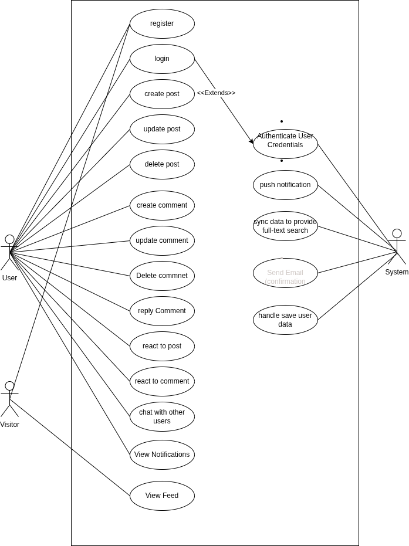
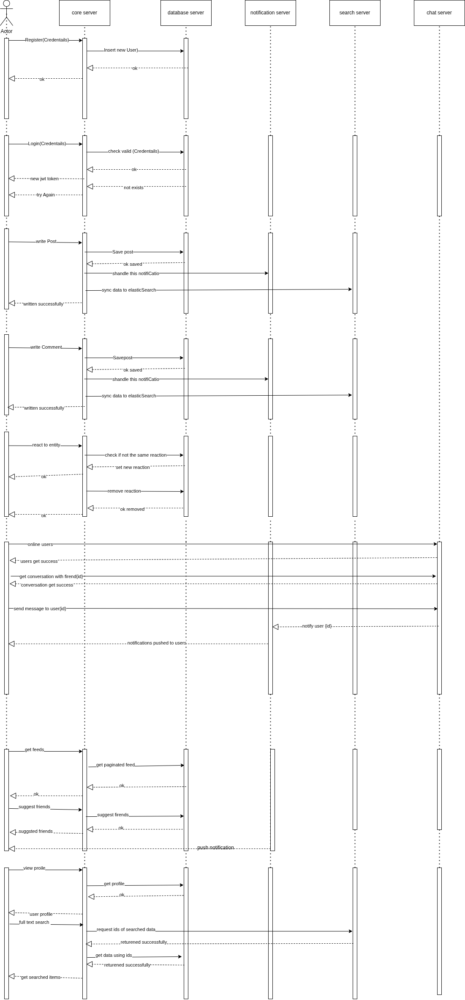

# Spring Boot Social Network Microservices (In Development)

### ⚠️ **Development Status**: This system is under active development. Some services may not work as expected. ⚠️

This project is a microservice-based social network backend system built using Spring Boot. It provides RESTful APIs for user authentication, profile management, post management, comment management, friendship features, full-text search using Elasticsearch, notification system using Kafka, and real-time chat using WebSocket.

**Last Updated**: September 2025
## ✅ Implemented Features
- [x] **User authentication (login, registration)**
- [x] **User profile management** (update profile picture, bio, skills)
- [x] **User post management** (create, view, update posts)
- [x] **User comment management** (create, view, update comments)
- [x] **Friendship system** (send/accept requests, mutual friends, suggestions)
- [x] **Full-text search using Elasticsearch**
- [x] **Notification system using Kafka**
- [x] **Chat system using WebSocket** (basic messaging, online user tracking)
- [x] **API documentation using Swagger**
- [x] **Security using Spring Security JWT**
- [x] **Dockerized services** (individual containers per service)

## 🚧 In Progress / Partial Implementation
- [ ] **Rate limiting using Redis** (setup started)
- [ ] **Caching using Redis** (infrastructure ready)
- [ ] **ELK stack logging**
    - [x] ELK stack Docker setup
    - [ ] Service integration with ELK
- [ ] **Docker Compose orchestration**
    - [x] Individual service containers
    - [ ] Main docker-compose.yml file
    - [ ] Complete system orchestration

## 📋 TODO - High Priority Features
- [ ] **Chat Service Security**
    - [ ] JWT authentication for WebSocket connections
    - [ ] Authorization for chat rooms
    - [ ] Offline message handling
- [ ] **Microservices Infrastructure**
    - [ ] Service discovery with Eureka
    - [ ] API Gateway routing
    - [ ] Load balancing with Nginx
    - [ ] Circuit breaker implementation
- [ ] **DevOps & Monitoring**
    - [ ] CI/CD pipeline with GitHub Actions
    - [ ] Health checks and monitoring
    - [ ] Centralized configuration
- [ ] **Authentication & Authorization**
    - [ ] Keycloak integration for SSO
    - [ ] Role-based access control enhancement

## 🏗️ Current Architecture Status

### ✅ Implemented Services
- **Main Service** (Port: 8083) - Core business logic, authentication, posts, comments, friendships
- **Search Service** - Elasticsearch integration for full-text search
- **Notification Service** - Kafka-based notification system
- **Chat Service** - WebSocket-based real-time messaging

### 🔧 Services in Development
- **Discovery Service** - Eureka service registry (skeleton created)
- **Gateway Service** - API Gateway for routing (skeleton created)

### 📋 Planned Services
- [ ] **Config Service** - Centralized configuration management
- [ ] **Monitoring Service** - Health checks and metrics
- [ ] **Security Service** - Enhanced Keycloak integration
- [ ] **Load Balancer** - Nginx-based load balancing

The services are deployed as Docker containers and managed using Docker Compose. The system is designed to be scalable, fault-tolerant, and secure.

## 🛠️ Technology Stack

### ✅ Currently Used
- **Backend**: Spring Boot, Spring Data JPA, Spring Security
- **Database**: PostgreSQL (Main), MongoDB (Chat), Elasticsearch (Search)
- **Messaging**: Apache Kafka
- **Real-time**: WebSocket
- **Documentation**: Swagger/OpenAPI
- **Containerization**: Docker
- **Build Tool**: Maven
- **Language**: Java 17+

### 🔧 Partially Implemented
- **Caching**: Redis (infrastructure ready)
- **Logging**: ELK Stack (Docker setup complete)
- **Service Discovery**: Eureka (service created, not integrated)
- **API Gateway**: Spring Cloud Gateway (basic setup)

### 📋 Planned Integrations
- **Authentication**: Keycloak for SSO
- **Load Balancing**: Nginx
- **Circuit Breaker**: Resilience4j
- **Monitoring**: Spring Boot Actuator + Micrometer
- **CI/CD**: GitHub Actions
- **Container Orchestration**: Complete Docker Compose setup

## 🔍 Service Details & Status

### **Main Service** ✅ (Port: 8083)
**Status**: Fully functional
- ✅ User authentication & registration (JWT)
- ✅ Profile management (bio, skills, profile picture)
- ✅ Post management (CRUD operations)
- ✅ Comment management (nested comments)
- ✅ Friendship system (requests, mutual friends, suggestions)
- ✅ File upload handling
- ✅ Swagger documentation available at `/swagger-ui.html`

### **Chat Service** ⚠️ (WebSocket)
**Status**: Basic functionality implemented, security pending
- ✅ WebSocket server setup
- ✅ MongoDB integration
- ✅ Online user tracking (join/leave)
- ✅ Real-time message sending/receiving
- ❌ **TODO**: JWT authentication for WebSocket
- ❌ **TODO**: Room-based authorization
- ❌ **TODO**: Offline message storage

### **Search Service** ✅
**Status**: Integrated with Elasticsearch
- ✅ Full-text search capabilities
- ✅ Kafka integration for automatic indexing
- ✅ Search across posts and users

### **Notification Service** ✅
**Status**: Kafka-based messaging working
- ✅ Kafka producer/consumer setup
- ✅ Event-driven notifications
- ✅ Multi-service communication

### **Discovery Service** 🔧 (Eureka)
**Status**: Service created but not integrated
- ✅ Basic Eureka server setup
- ❌ **TODO**: Client registration from other services
- ❌ **TODO**: Load balancing configuration

### **Gateway Service** 🔧 (Spring Cloud Gateway)
**Status**: Skeleton created
- ✅ Basic gateway structure
- ❌ **TODO**: Route configuration
- ❌ **TODO**: Security integration
- ❌ **TODO**: Load balancing setup

## 🔐 Authentication Flow

The system uses a **centralized authentication** approach with JWT tokens managed by a dedicated Auth Service.

### Architecture Components
- **Auth Service** (Port: 8087): Centralized authentication and token validation
- **Gateway Service**: Entry point with authentication filtering
- **Shared Security Library**: Reusable authentication components across microservices
- **Feign Client**: Inter-service communication for token validation

### Flow Diagrams

#### 1. User Login Flow
```
Client → Gateway → Auth Service
1. User sends credentials (email/password) to POST /api/auth/login
2. Auth Service validates credentials via Spring Security AuthenticationManager
3. Generates JWT access token + refresh token
4. Stores token in database for revocation tracking
5. Updates user's last login timestamp
6. Returns AuthResponse with tokens and user info
```

#### 2. Request Authentication (via API Gateway)
```
Client → Gateway → Auth Service → Downstream Service
1. Client includes header: Authorization: Bearer <token>
2. Gateway filter (AuthenticationGatewayFilterFactory) intercepts all requests
3. Calls Auth Service via Feign Client to validate token
4. Auth Service validates:
   - Token expiration
   - Token revocation status in database
   - JWT signature and claims
5. If valid:
   - Gateway adds user context headers:
     * X-User-Id: User's ID
     * X-User-Email: User's email
     * X-User-Roles: Comma-separated roles
   - Forwards request to downstream service
6. If invalid: Returns 401 Unauthorized
```

#### 3. Service-Level Authentication
```
Request → Service Filter → Controller
1. JwtAuthenticationFilter (from shared-security-lib) intercepts requests
2. Calls Auth Service via Feign Client to validate token
3. If valid:
   - Creates Spring Security authentication object
   - Sets SecurityContext with user details and roles
   - Request proceeds to controller
4. If invalid: Returns 401 with error message
```

#### 4. Token Validation (Auth Service)
```
Service → Auth Service /api/auth/validate-header
1. Checks token expiration date
2. Queries database for token revocation status
3. Extracts username from JWT claims
4. Validates token signature
5. Loads user details from database
6. Returns TokenValidationResponse:
   - isValid: true/false
   - userId, email, roles (if valid)
   - error message (if invalid)
```

#### 5. Logout Flow
```
Single Device Logout:
1. Client sends POST /api/auth/logout with token
2. Auth Service marks specific token as expired/revoked in database

All Devices Logout:
1. Client sends POST /api/auth/logout-all?userId=<id>
2. Auth Service revokes all tokens for the user
```

### What is Feign Client?

**Feign Client** is a **declarative HTTP client** from Spring Cloud that simplifies inter-service communication.

**Location**: `shared/security-lib/src/main/java/com/app/shared/security/client/AuthServiceClient.java`

```java
@FeignClient(name = "auth-service", url = "${auth-service.url:http://localhost:8087}", path = "/api/auth")
public interface AuthServiceClient {
    @PostMapping("/validate-header")
    TokenValidationResponse validateToken(@RequestHeader("Authorization") String authHeader);
}
```

**Benefits**:
- **No manual HTTP client code**: Auto-generates RestTemplate/WebClient code
- **Type-safe**: Returns deserialized Java objects
- **Centralized configuration**: All services call auth-service using same interface
- **Used by**: Gateway Service, Main Service, Chat Service, and all other microservices

**How it works**:
1. Define interface with HTTP annotations (@PostMapping, @RequestHeader, etc.)
2. Feign generates implementation at runtime
3. Makes actual HTTP call to auth-service
4. Deserializes JSON response to `TokenValidationResponse`

### Security Features Implemented
✅ Centralized authentication service
✅ JWT-based stateless authentication
✅ Token revocation tracking in database
✅ Gateway-level authentication filtering
✅ Service-level security filters
✅ Role-based access control (RBAC)
✅ Multi-device logout support
✅ Token expiration validation

### Authentication Endpoints (Auth Service)
| Endpoint | Method | Description |
|----------|--------|-------------|
| `/api/auth/login` | POST | User login with credentials |
| `/api/auth/validate` | POST | Validate token (query param) |
| `/api/auth/validate-header` | POST | Validate token (header) |
| `/api/auth/logout` | POST | Logout current device |
| `/api/auth/logout-all` | POST | Logout all devices |

## UML Diagram
### 1. Use-Case Diagram


### 2. Use-Sequence Diagram


## Database Schema
The system uses the following database schema:


## Microservices Architecture


Overall, our backend system provides the necessary interfaces to create a full-featured social media platform. Our frontend developers can utilize these interfaces to create a seamless user experience, while our backend team ensures the reliability and scalability of the system.
### api documentation 


### Deployment Architecture
```plaintext
.
├── docker
│   ├── docker-compose-kafka.yml
│   ├── docker-dev-entrypoint.sh
│   └── elk-stack-docker
│       ├── docker-compose-elk.yml
│       └── logstash.conf
├── docker-compose-dev.yaml
├── docker-compose-prod.yaml
└── services
    ├── chat-service
    │   ├── docker
    │   │   └── dev
    │   │       ├── docker-compose.yml
    │   │       └── Dockerfile
    ├── discovery-service
    │   ├── docker
    │   │   └── dev
    │   │       ├── docker-compose.yml
    │   │       └── Dockerfile
    ├── gateway-service
    │   ├── docker
    │   │   └── dev
    │   │       ├── docker-compose.yml
    │   │       └── Dockerfile
    ├── main-service
    │   ├── docker
    │   │   ├── dev
    │   │   │   ├── docker-compose.yaml
    │   │   │   ├── Dockerfile.dev
    │   │   │   └── Dockerfile.dev.psql
    │   │   └── production
    │   │       ├── docker-compose-app-production.yaml
    │   │       ├── Dockerfile.production
    │   │       └── Dockerfile.production.psql
    ├── notification-service
    │   ├── docker
    │   │   └── dev
    │   │       ├── docker-compose.yml
    │   │       └── Dockerfile
    └── search-service
        ├── docker
        │   └── dev
        │       ├── docker-compose.yml
        │       └── Dockerfile

```
## 🚀 Quick Start Guide

### Prerequisites
- **Docker** and **Docker Compose** installed
- **Java 17+** (for local development)
- **Maven 3.6+** (for building)

### Option 1: Docker Setup (Recommended)
1. **Clone the repository**
   ```bash
   git clone <repository-url>
   cd social-network-microservices
   ```

2. **Navigate to docker directory**
   ```bash
   cd docker
   ```

3. **Run the development setup script**
   ```bash
   chmod +x docker-dev-entrypoint.sh
   ./docker-dev-entrypoint.sh
   ```

### Option 2: Individual Service Setup
If the main docker-compose.yml is missing, start services individually:

1. **Start infrastructure services:**
   ```bash
   cd docker
   docker-compose -f docker-compose-kafka.yml up -d
   docker-compose -f elk-stack-docker/docker-compose-elk.yml up -d
   ```

2. **Build and run each service:**
   ```bash
   # Main Service
   cd services/main-service
   mvn spring-boot:run

   # Chat Service
   cd services/chat-service
   mvn spring-boot:run

   # Other services...
   ```

## 🌐 Service Endpoints

Once running, access the services at:
- **Main Service API**: http://localhost:8083
- **Swagger Documentation**: http://localhost:8083/swagger-ui.html
- **Chat WebSocket**: ws://localhost:8084/ws
- **Elasticsearch**: http://localhost:9200
- **Kibana**: http://localhost:5601

## 🔧 Development Hints & Next Steps

### **Immediate TODOs (High Priority)**
1. **Fix Docker Orchestration**
   - Create main `docker-compose.yml` file
   - Ensure all services start together
   - Fix service discovery configuration

2. **Secure Chat Service**
   - Implement JWT authentication in `WebSocketConfig.java`
   - Add authorization interceptor
   - Create offline message storage

3. **Complete Gateway Integration**
   - Configure routes in `gateway-service`
   - Set up load balancing
   - Integrate with Eureka discovery

### **Development Setup Issues**
⚠️ **Known Issues**:
- Main docker-compose.yml file is missing (referenced but not created)
- Services may not communicate properly without service discovery
- Chat service WebSocket lacks authentication
- ELK integration incomplete

### **Testing Endpoints**
```bash
# Register user
curl -X POST http://localhost:8083/api/auth/signup \
  -H "Content-Type: application/json" \
  -d '{"username":"testuser","email":"test@test.com","password":"password123"}'

# Login
curl -X POST http://localhost:8083/api/auth/signin \
  -H "Content-Type: application/json" \
  -d '{"username":"testuser","password":"password123"}'
```

---

## 📋 Comprehensive Project TODO List

### ** Critical Priority**
- [ ] **Create main docker-compose.yml** - Referenced everywhere but missing
- [ ] **Fix WebSocket security** - No authentication currently
- [ ] **Complete service discovery** - Eureka client integration
- [ ] **API Gateway routing** - Configure proper request routing

### ** Infrastructure & DevOps**
- [ ] **Monitoring Setup**
  - [ ] Integrate Spring Boot Actuator in all services
  - [ ] Set up Prometheus + Grafana
  - [ ] Health check endpoints
- [ ] **CI/CD Pipeline**
  - [ ] GitHub Actions workflow
  - [ ] Automated testing
  - [ ] Container registry integration
- [ ] **Logging Enhancement**
  - [ ] Logback configuration for ELK
  - [ ] Structured logging with correlation IDs
  - [ ] Log aggregation setup

### ** Security & Performance**
- [ ] **Chat Service Security**
  - [ ] JWT token validation in WebSocket handshake
  - [ ] Room-based authorization
  - [ ] Message encryption for sensitive chats
- [ ] **Rate Limiting**
  - [ ] Redis-based rate limiting
  - [ ] API endpoint protection
  - [ ] DDoS protection
- [ ] **Caching Strategy**
  - [ ] Redis caching for frequent queries
  - [ ] Cache invalidation strategies
  - [ ] Session management

### ** Feature Enhancements**
- [ ] **Chat Improvements**
  - [ ] File sharing in chat
  - [ ] Message reactions and replies
  - [ ] Group chat functionality
  - [ ] Message search and history
- [ ] **Social Features**
  - [ ] User blocking functionality
  - [ ] Privacy settings
  - [ ] Content moderation
  - [ ] Recommendation engine
- [ ] **Notification Enhancements**
  - [ ] Email notifications
  - [ ] Push notifications
  - [ ] Notification preferences

### ** Testing & Quality**
- [ ] **Test Coverage**
  - [ ] Unit tests for all services
  - [ ] Integration tests
  - [ ] End-to-end testing
  - [ ] Load testing with JMeter
- [ ] **Code Quality**
  - [ ] SonarQube integration
  - [ ] Code coverage reports
  - [ ] Security vulnerability scanning

### ** Documentation**
- [ ] **API Documentation**
  - [ ] Complete OpenAPI specifications
  - [ ] Postman collections
  - [ ] SDK generation
- [ ] **Technical Documentation**
  - [ ] Architecture decision records
  - [ ] Deployment guides
  - [ ] Troubleshooting documentation

---

### ⚠️ **Current Development Status Summary**
- **Working**: Main service, basic chat, search, notifications
- **Needs Work**: Security, service discovery, Docker orchestration
- **Missing**: Main docker-compose, proper logging, monitoring
- **Next Focus**: Fix Docker setup → Secure chat → Complete gateway

---
