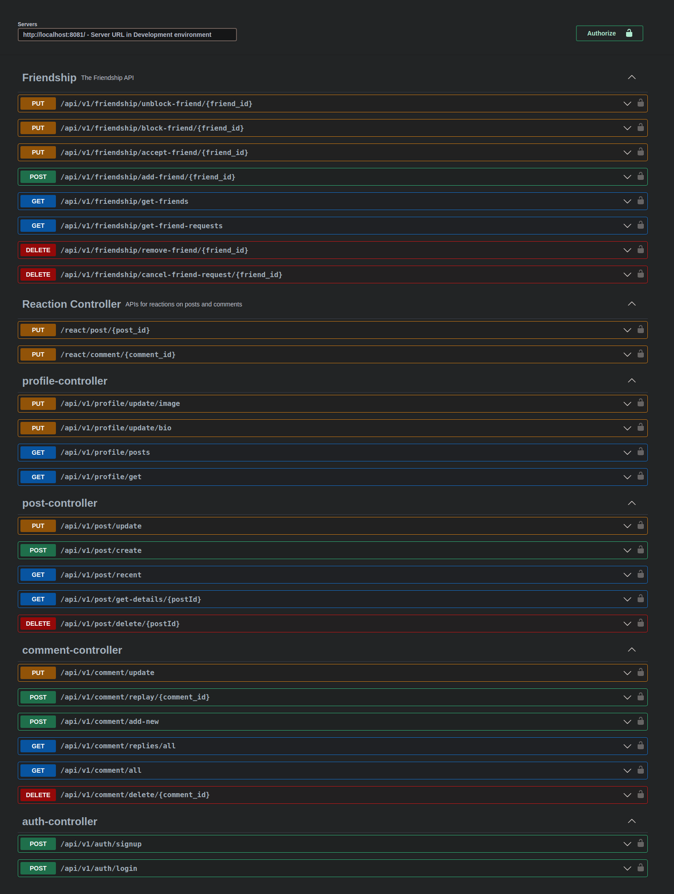

# spring boot (social-network) rest api (in-progress)
This project is a microservice-based social network backend system built using Spring Boot. It provides a set of RESTful APIs for user authentication, profile management, post management, and comment management.
and provide full-text search using elasticsearch, and also provide a notification system using kafka, and also provide a chat system using websocket.
## Features
- User authentication (login, registration)
- User profile management (update profile picture, bio, skills)
- User post management (create, view, update posts)
- User comment management (create, view, update comments)
- Full-text search using Elasticsearch
- Notification system using Kafka
- Chat system using Websocket
- Rate limiting using Redis
- Caching using Redis
- Logging using ELK stack (Elasticsearch, Logstash, Kibana)
- Monitoring using Spring Boot Actuator.
- Dockerized using Docker and Docker Compose
- CI/CD using GitHub Actions
- API documentation using Swagger
- Security using Spring Security Keycloak
- Load balancing using Nginx
- Circuit breaking using Resilience4j

## Architecture
The system is designed using a microservice architecture, with each service responsible for a specific set of functionalities. The services communicate with each other using RESTful APIs and message queues. The architecture consists of the following services:

- **User Service**: Responsible for user authentication and registration.
- **Profile Service**: Responsible for managing user profiles.
- **Post Service**: Responsible for managing user posts.
- **Comment Service**: Responsible for managing user comments.
- **Search Service**: Responsible for full-text search using Elasticsearch.
- **Notification Service**: Responsible for sending notifications using Kafka.
- **Chat Service**: Responsible for chat functionality using Websocket.
- **Gateway Service**: Responsible for routing requests to the appropriate services.
- **Config Service**: Responsible for managing configuration properties.
- **Discovery Service**: Responsible for service discovery using Eureka.
- **Monitoring Service**: Responsible for monitoring using Spring Boot Actuator.
- **Logging Service**: Responsible for logging using ELK stack.
- **Security Service**: Responsible for security using Spring Security Keycloak.
- **Load Balancer Service**: Responsible for load balancing using Nginx.
- **Circuit Breaker Service**: Responsible for circuit breaking using Resilience4j.
- **Rate Limiting Service**: Responsible for rate limiting using Redis.
- **Caching Service**: Responsible for caching using Redis.
- **API Documentation Service**: Responsible for API documentation using Swagger.
- **CI/CD Service**: Responsible for CI/CD using GitHub Actions.
- **Docker Service**: Responsible for containerization using Docker and Docker Compose.

The services are deployed as Docker containers and managed using Docker Compose. The system is designed to be scalable, fault-tolerant, and secure.

## Technologies
The system is built using the following technologies:

- **Spring Boot**: For building microservices.
- **Spring Data JPA**: For data access.
- **Spring Security**: For security.
- **Spring Cloud**: For microservice architecture.
- **Elasticsearch**: For full-text search.
- **Kafka**: For message queuing.
- **Websocket**: For real-time chat functionality.
- **Redis**: For rate limiting and caching.
- **ELK Stack**: For logging.
- **Spring Boot Actuator**: For monitoring.
- **Spring Security Keycloak**: For security.
- **Nginx**: For load balancing.
- **Resilience4j**: For circuit breaking.
- **Swagger**: For API documentation.
- **GitHub Actions**: For CI/CD.
- **Docker**: For containerization.
- **Docker Compose**: For managing containers.
- **Java**: For programming language.
- **Maven**: For dependency management.
- **Git**: For version control.
- **IntelliJ IDEA**: For IDE.
- **Postman**: For API testing.
- **Linux**: For operating system.
- **Bash**: For shell scripting.
- **Markdown**: For documentation.
- **Draw.io**: For diagrams.
- **Google Cloud Platform**: For cloud services.
- **Keycloak**: For identity and access management.
- **Eureka**: For service discovery.
- **Nginx**: For load balancing.
- **Resilience4j**: For circuit breaking.
- **Redis**: For rate limiting and caching.
- **Swagger**: For API documentation.
- **GitHub Actions**: For CI/CD using GitHub Actions.

## Services
The system consists of the following services:

- **User Service**: Responsible for user authentication and registration.
- **Profile Service**: Responsible for managing user profiles.
- **Post Service**: Responsible for managing user posts.
- **Comment Service**: Responsible for managing user comments.
- **Search Service**: Responsible for full-text search using Elasticsearch.
- **Notification Service**: Responsible for sending notifications using Kafka.
- **Chat Service**: Responsible for chat functionality using Websocket.
- **Gateway Service**: Responsible for routing requests to the appropriate services.
- **Config Service**: Responsible for managing configuration properties.
- **Discovery Service**: Responsible for service discovery using Eureka.
- **Monitoring Service**: Responsible for monitoring using Spring Boot Actuator.
- **Logging Service**: Responsible for logging using ELK stack.
- **Security Service**: Responsible for security using Spring Security Keycloak.
- **Load Balancer Service**: Responsible for load balancing using Nginx.
- **Circuit Breaker Service**: Responsible for circuit breaking using Resilience4j.
- **Rate Limiting Service**: Responsible for rate limiting using Redis.
- **Caching Service**: Responsible for caching using Redis.
- **API Documentation Service**: Responsible for API documentation using Swagger.
- **CI/CD Service**: Responsible for CI/CD using GitHub Actions.
- **Docker Service**: Responsible for containerization using Docker and Docker Compose.
- **Keycloak Service**: Responsible for identity and access management using Keycloak.
- **Eureka Service**: Responsible for service discovery using Eureka.

## Database Schema
The system uses the following database schema:


## Microservices Architecture


Overall, our backend system provides the necessary interfaces to create a full-featured social media platform. Our frontend developers can utilize these interfaces to create a seamless user experience, while our backend team ensures the reliability and scalability of the system.
### api documentation 


## How to run social-network rest api (using docker && docker-compose)
1. Clone the repository
2. Run the following command to build the docker image
3. Run ELK stack using the following command
```bash
docker-compose -f docker-compose-elk.yaml up -d
```
4. Run the following command to start the services.
```bash
docker-compose-dev.yaml -f docker-compose-dev.yaml-dev.yaml --env-file .env up -d  --build
```

3 The system will be up and running on the following ports:
- **Main Service**: http://localhost:8083
- swagger documentation: http://localhost:8083/swagger-ui.html
