# Social Network Microservices Platform

A scalable microservice-based social network backend system built with Spring Boot, featuring event-driven architecture, real-time communication, and distributed data management. This platform demonstrates modern enterprise patterns including service discovery, API gateway routing, message-driven systems, and comprehensive observability.

**Development Status**: Production-ready microservices platform with complete infrastructure services. Active development continues on performance optimizations and advanced features.

**Last Updated**: April 2026

## Features

### Core Functionality
- User authentication and authorization with JWT token management
- **OAuth2 Social Login** (Google, Facebook, GitHub) with automatic user registration
- User profile management with support for bio, skills, and profile pictures
- Post creation and management with full CRUD operations
- Comment system with nested comment support
- Friendship system including friend requests, mutual friends, and friend suggestions
- Full-text search powered by Elasticsearch
- Event-driven notification system using Apache Kafka
- Real-time chat functionality via WebSocket with online user tracking
- Multi-device session management and selective logout
- OTP verification system with email delivery
- Comprehensive API documentation via Swagger/OpenAPI
- Containerized deployment using Docker

### Security & Infrastructure
- JWT-based stateless authentication with token revocation
- Centralized authentication service with Feign client integration
- Gateway-level and service-level security filters
- Role-based access control across all services
- **Token Bucket rate limiting** at the API Gateway (Redis-backed, per-route configurable)
- Centralized logging with ELK stack (Elasticsearch, Logstash, Kibana)
- Multi-database architecture (PostgreSQL, Cassandra, Elasticsearch)

### In Progress
- Redis-based caching
- Enhanced monitoring and observability (ELK stack configuration refinement)
- Performance optimizations

## Architecture Overview

The system follows a microservices architecture pattern with each service having a specific responsibility. Services communicate through both synchronous REST APIs and asynchronous event-driven messaging via Apache Kafka. The platform is designed to be horizontally scalable, fault-tolerant, and maintainable.

### Service Topology

**Production Services**
- **Auth Service** (Port: 8087) - Centralized authentication and JWT token management
- **Main Service** (Port: 8083) - Core business logic including posts, comments, and friendships
- **Search Service** - Full-text search powered by Elasticsearch with Kafka-based indexing
- **Notification Service** - Event-driven notification system consuming Kafka topics
- **Chat Service** (Port: 8086) - Real-time messaging via WebSocket/STOMP, Cassandra persistence, Kafka async pipeline

**Infrastructure Services**
- **Gateway Service** (Port: 8081) - API routing and load balancing with authentication filtering
- **Discovery Service** - Eureka-based service registry for dynamic service discovery

All services are containerized using Docker and can be orchestrated via Docker Compose for both development and production environments.

## Technology Stack

**Core Framework**
- Java 17
- Spring Boot 3.x
- Spring Cloud
- Spring Security with JWT

**Data Management**
- PostgreSQL - Primary relational database for:
  - Auth Service: User credentials, JWT tokens, revocation tracking
  - Main Service: User data, posts, comments, friendships, reactions
  - Notification Service: Notification history, read/unread status, delivery tracking
- Cassandra - Distributed KV store for permanent chat message storage (cursor-paginated via Snowflake IDs)
- Elasticsearch - Full-text search engine for content discovery
- Redis - Caching and session management (infrastructure ready)

**Communication & Messaging**
- Apache Kafka - Event streaming and inter-service messaging
- **Debezium + Kafka Connect** - Change Data Capture (CDC) on PostgreSQL WAL for user identity propagation
- WebSocket - Real-time bidirectional communication for chat
- OpenFeign - Declarative REST client for inter-service calls

**DevOps & Observability**
- Docker - Container platform
- Docker Compose - Multi-container orchestration
- ELK Stack (Elasticsearch, Logstash, Kibana) - Centralized logging and monitoring
- Swagger/OpenAPI - API documentation
- Maven - Build automation

## Service Details & Status

### Auth Service (Port: 8087)
**Status**: Production ready with OAuth2 social login
- Centralized authentication and authorization
- JWT token generation and validation
- Token revocation tracking in PostgreSQL database
- Multi-device logout support
- User registration and login with Spring Security
- **OAuth2 Social Login** (Google, Facebook, GitHub)
  - Google OAuth2 authentication (fully tested and working)
  - Facebook OAuth2 configuration (ready for testing)
  - GitHub OAuth2 configuration (ready for testing)
  - Automatic user registration/linking via OAuth2
  - Custom OAuth2 success and failure handlers
  - Seamless JWT token generation for OAuth2 users
- Feign client integration for inter-service communication
- OTP functionality with email verification
- Device fingerprinting and multi-device session management
- **CDC via Debezium**: user identity changes propagate automatically through PostgreSQL WAL — no dual-write, no outbox table
  - Postgres publication filters to `email_verified = true` — unverified rows never enter the event stream
  - Connector config: `services/auth-service/debezium/users-cdc-connector.json`
  - Sensitive columns (`password`, `oauth_provider`, `oauth_provider_id`) excluded at connector level
- Swagger documentation available at `/swagger-ui.html`
- **TODO**: Migrate token storage to Redis for improved performance
- **TODO**: Add Redis-based session management
- **TODO**: Test and verify Facebook/GitHub OAuth2 integration
- **TODO**: Implement OAuth2 account linking (multiple providers per user)

### Main Service (Port: 8083)
**Status**: Fully functional
- User authentication and registration with JWT tokens
- Profile management including bio, skills, and profile picture
- Post management with full CRUD operations
- Reaction system for posts (like, love, etc.)
- Comment management with support for nested comments
- Comment reply functionality
- Comment reactions
- Friendship system featuring requests, mutual friends, and friend suggestions
- File upload handling for user content (File System storage currently)
- **CDC-driven `UserProfile` sync**: `user_profiles` table is automatically populated from `user-events` Kafka topic (sourced by Debezium CDC on auth-service's `users` table)
  - Idempotent upsert — safe to replay on consumer restart or Kafka redelivery
  - `auto-offset-reset: earliest` — catches all events including those published while the service was down
  - Retry with exponential backoff (1s → 2s → 4s → 8s) on transient DB failures; exhausted retries go to `user-events.DLT`
- Swagger documentation available at `/swagger-ui.html`
- SetUp S3 Compatible storage for file uploads (MinIO) instead of local storage.
- **TODO**: create indexes in postgreSQL for performance optimization (create index on foreign keys to speed up joins)
- **TODO**: Implement Redis caching for frequently accessed data (user data).
- **TODO**: Add rate limiting for critical endpoints
- **TODO**: Implement soft deletes for posts and comments
- **TODO**: Add content moderation features (e.g., reporting, filtering)
- **TODO**: Implement analytics for user engagement
- **TODO**: Integrate with Prometheus and Grafana for metrics monitoring
- **TODO**: Implement CI/CD pipeline for automated testing and deployment
- **TODO**: Add integration tests for critical workflows
- **TODO**: Implement database migration strategy (e.g., Flyway or Liquibase)

### Chat Service (WebSocket)
**Status**: Phase 1 (foundation) complete — scalable redesign in progress
- WebSocket server with STOMP/SockJS, JWT authentication via HTTP-only cookies
- **Snowflake ID generation** per message (datacenter + machine + sequence bits), worker ID assigned via Zookeeper ephemeral sequential node
- **Kafka-based async message pipeline** — messages published to `chat-messages` topic (partitioned by `conversationId` for ordering guarantees)
- **Dual-write transition**: Kafka publish + Redis write-through during Phase 1; Redis removed in Phase 3
- **Cassandra persistence** (`messages_by_conversation` table) via dedicated Persistence Consumer — manual offset commit ensures offset only acknowledged after successful write
- **Cross-instance routing** — `userId → instanceId` stored in Redis on connect; Delivery Consumer routes via Redis Pub/Sub to the correct Chat Service instance
- Heartbeat-based presence (10s interval, 30s timeout) replacing fragile connect/disconnect tracking
- 1:1 private messaging with friendship validation
- **TODO**: Group chat (max 100 members) with fan-out in Delivery Consumer
- **TODO**: Presence Service as standalone microservice
- **TODO**: Remove dual-write (Phase 3)
- **TODO**: API documentation with Swagger

### Search Service
**Status**: Integrated with Elasticsearch
- Full-text search capabilities across the platform
- Kafka integration for automatic content indexing
- Search functionality across posts and user profiles
- **CDC-driven user index sync**: consumes `user-events` via a dedicated `userEventListenerContainerFactory` (separate from the post/comment factory — correct `StringDeserializer` vs `JsonDeserializer` per topic)
  - ES document ID set to `userId` — upsert is idempotent, no duplicate documents on replay
  - Retry with exponential backoff + dead letter topic (`user-events.DLT`) on ES failures

### Notification Service (Port: 8085)
**Status**: Fully functional with PostgreSQL persistence
- PostgreSQL database for notification storage and history
- Kafka producer and consumer setup complete
- Event-driven notification system consuming Kafka topics
- Multi-service communication established
- REST API for retrieving, marking read, and managing notifications
- Notification persistence with read/unread status tracking
- Paginated notification retrieval by user, type, and read status
- Database indexing on receiver_id, read status, and timestamps for performance
- Automated cleanup of old read notifications
- Swagger documentation available at `/swagger-ui.html`
- **TODO**: Implement notification delivery mechanisms (email, push notifications)
- **TODO**: User preferences for notification settings
- **TODO**: Real-time notification delivery via WebSocket
- **TODO**: Implement retry mechanisms for failed notifications
- **TODO**: Analytics for notification engagement
- **TODO**: Rate limiting for notification sending

### Discovery Service (Eureka)
**Status**: Fully functional
- Eureka server setup complete and running
- All microservices registered and discoverable
- Service health monitoring and heartbeat tracking
- Dynamic service discovery enabled
- **TODO**: Advanced load balancing configuration
- **TODO**: Multi-zone deployment support
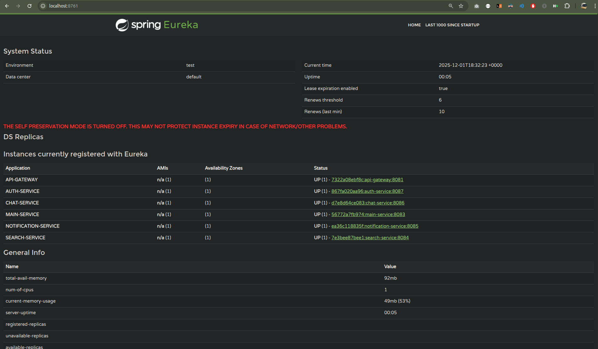

### Gateway Service (Spring Cloud Gateway)
**Status**: Fully functional
- Spring Cloud Gateway routing configured
- Authentication filtering integrated with Auth Service
- Route configuration for all microservices
- Load balancing with Eureka service discovery
- Security integration complete
- **Token Bucket rate limiting** (Redis-backed) with per-route configuration:
  - Algorithm: Token Bucket via `RedisRateLimiter`
  - Key strategies: by authenticated user ID (from JWT), fallback to IP; IP-only for auth endpoints
  - Configurable via `application.yml` — no code changes needed:
    ```yaml
    gateway:
      rate-limiter:
        auth:    { rate: 5,  per: MINUTE, burst: 1  }   # brute-force protection
        general: { rate: 30, per: SECOND, burst: 60 }   # posts, notifications
        search:  { rate: 15, per: SECOND, burst: 30 }
        chat:    { rate: 20, per: SECOND, burst: 40 }
    ```
  - Supported time units: `SECOND`, `MINUTE`, `HOUR`, `DAY`
  - Returns `429 Too Many Requests` with `X-RateLimit-Remaining` headers
- **TODO**: Circuit breaker patterns
- **TODO**: Request/response logging enhancements

### Centralized Logging (ELK Stack)
**Status**: ELK stack deployed via Docker
- Logstash configured to collect logs from all services
- Kibana dashboard setup for log visualization
- **TODO**: Fine-tune log parsing and indexing
- **TODO**: Implement alerting based on log patterns
- **TODO**: Integrate with Prometheus and Grafana for metrics monitoring
- **TODO**: Set up log retention policies
- 
## Authentication Flow

The system uses a **centralized authentication** approach with JWT tokens managed by a dedicated Auth Service.

### Architecture Components
- **Auth Service** (Port: 8087): Centralized authentication and token validation
- **Gateway Service**: Entry point with authentication filtering
- **Shared Security Library**: Reusable authentication components across microservices
- **Feign Client**: Inter-service communication for token validation

### Flow Diagrams

#### 1. User Login Flow
```
Client → Gateway → Auth Service
1. User sends credentials (email/password) to POST /api/auth/login
2. Auth Service validates credentials via Spring Security AuthenticationManager
3. Generates JWT access token + refresh token
4. Stores token in database for revocation tracking
5. Updates user's last login timestamp
6. Returns AuthResponse with tokens and user info
```

#### 2. Request Authentication (via API Gateway)
```
Client → Gateway → Auth Service → Downstream Service
1. Client includes header: Authorization: Bearer <token>
2. Gateway filter (AuthenticationGatewayFilterFactory) intercepts all requests
3. Calls Auth Service via Feign Client to validate token
4. Auth Service validates:
   - Token expiration
   - Token revocation status in database
   - JWT signature and claims
5. If valid:
   - Gateway adds user context headers:
     * X-User-Id: User's ID
     * X-User-Email: User's email
     * X-User-Roles: Comma-separated roles
   - Forwards request to downstream service
6. If invalid: Returns 401 Unauthorized
```

#### 3. Service-Level Authentication
```
Request → Service Filter → Controller
1. JwtAuthenticationFilter (from shared-security-lib) intercepts requests
2. Calls Auth Service via Feign Client to validate token
3. If valid:
   - Creates Spring Security authentication object
   - Sets SecurityContext with user details and roles
   - Request proceeds to controller
4. If invalid: Returns 401 with error message
```

#### 4. Token Validation (Auth Service)
```
Service → Auth Service /api/auth/validate-header
1. Checks token expiration date
2. Queries database for token revocation status
3. Extracts username from JWT claims
4. Validates token signature
5. Loads user details from database
6. Returns TokenValidationResponse:
   - isValid: true/false
   - userId, email, roles (if valid)
   - error message (if invalid)
```

#### 5. Logout Flow
```
Single Device Logout:
1. Client sends POST /api/auth/logout with token
2. Auth Service marks specific token as expired/revoked in database

All Devices Logout:
1. Client sends POST /api/auth/logout-all?userId=<id>
2. Auth Service revokes all tokens for the user
```

### What is Feign Client?

**Feign Client** is a **declarative HTTP client** from Spring Cloud that simplifies inter-service communication.

**Location**: `shared/security-lib/src/main/java/com/app/shared/security/client/AuthServiceClient.java`

```java
@FeignClient(name = "auth-service", url = "${auth-service.url:http://localhost:8087}", path = "/api/auth")
public interface AuthServiceClient {
    @PostMapping("/validate-header")
    TokenValidationResponse validateToken(@RequestHeader("Authorization") String authHeader);
}
```

**Benefits**:
- **No manual HTTP client code**: Auto-generates RestTemplate/WebClient code
- **Type-safe**: Returns deserialized Java objects
- **Centralized configuration**: All services call auth-service using same interface
- **Used by**: Gateway Service, Main Service, Chat Service, and all other microservices

**How it works**:
1. Define interface with HTTP annotations (@PostMapping, @RequestHeader, etc.)
2. Feign generates implementation at runtime
3. Makes actual HTTP call to auth-service
4. Deserializes JSON response to `TokenValidationResponse`

### Security Features Implemented
- Centralized authentication service
- JWT-based stateless authentication
- **OAuth2 social login integration** (Google, Facebook, GitHub)
- Token revocation tracking in database
- Gateway-level authentication filtering
- Service-level security filters
- Role-based access control (RBAC)
- Multi-device logout support
- Device fingerprinting and session tracking
- Token expiration validation
- Custom OAuth2 authentication handlers
- Automatic email verification for OAuth2 users

## Architecture Diagrams

The system architecture is documented using PlantUML diagrams, providing visual representations of service interactions, data flows, and deployment topology. All diagram source files are located in the `diagrams/` directory and can be viewed using the PlantUML Web Server, VS Code PlantUML extension, or IntelliJ IDEA PlantUML plugin.

### System Architecture Diagram

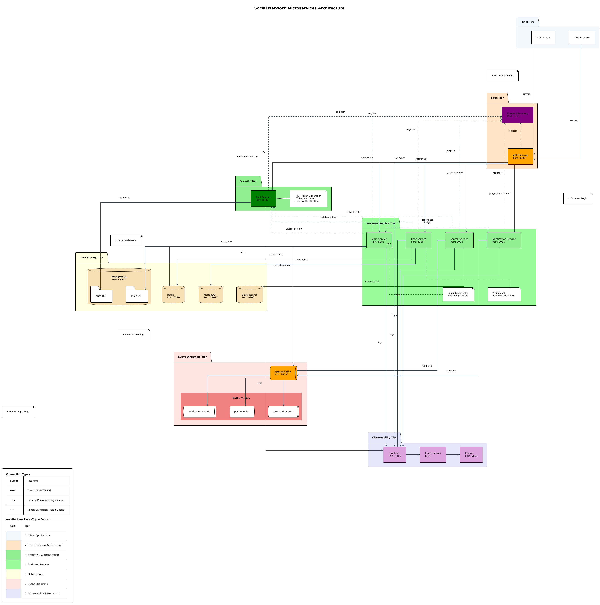

**Source**: [`diagrams/microservices-architecture.puml`](diagrams/microservices-architecture.puml)

This diagram illustrates the complete microservices ecosystem including all services, databases, message brokers, and communication patterns. It shows the topology of seven microservices with their respective ports, the multi-database architecture (PostgreSQL, MongoDB, Elasticsearch, Redis), Kafka event-driven messaging, Eureka service discovery, ELK stack for centralized logging, and gateway-based routing.

### Event-Driven Architecture

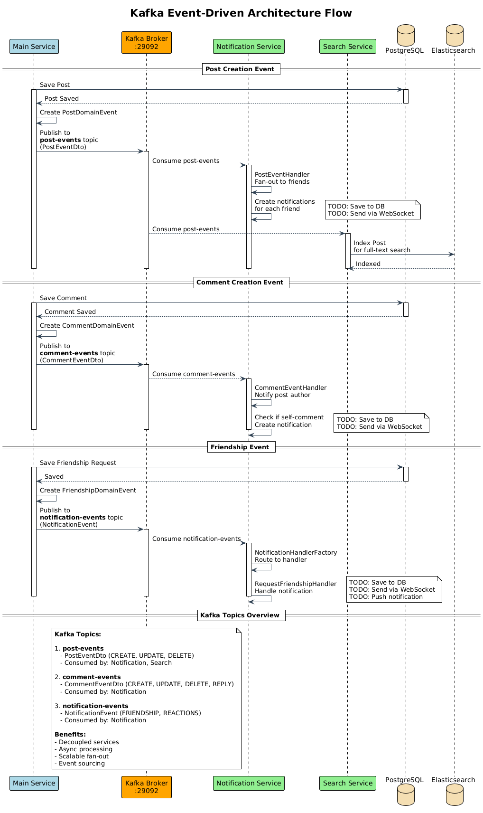

**Source**: [`diagrams/kafka-event-flow.puml`](diagrams/kafka-event-flow.puml)

Demonstrates event-driven communication patterns using Apache Kafka. The system uses three primary topics: `post-events` for post lifecycle events, `comment-events` for comment operations, and `notification-events` for friendship and reaction events. This architecture enables automatic content indexing in Elasticsearch and fan-out notifications to connected users.

### Authentication Architecture

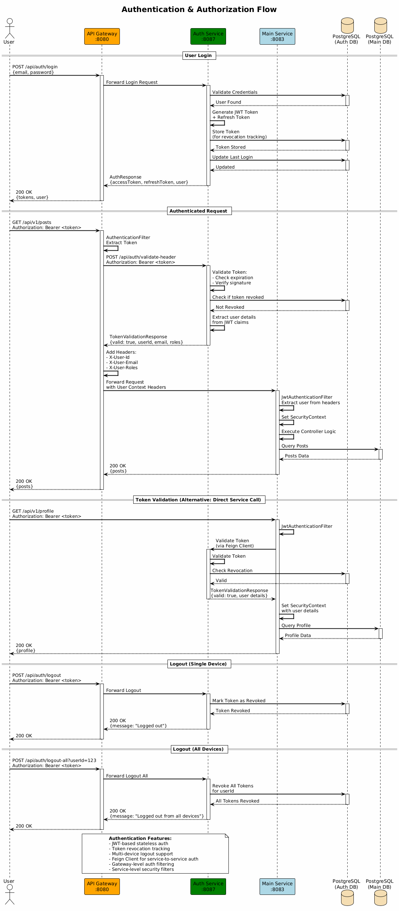

**Source**: [`diagrams/authentication-flow.puml`](diagrams/authentication-flow.puml)

Details the JWT-based authentication system with centralized token management. The flow covers user login, token validation at both gateway and service levels, inter-service authentication via Feign clients, and multi-device logout capabilities.

### Deployment Topology

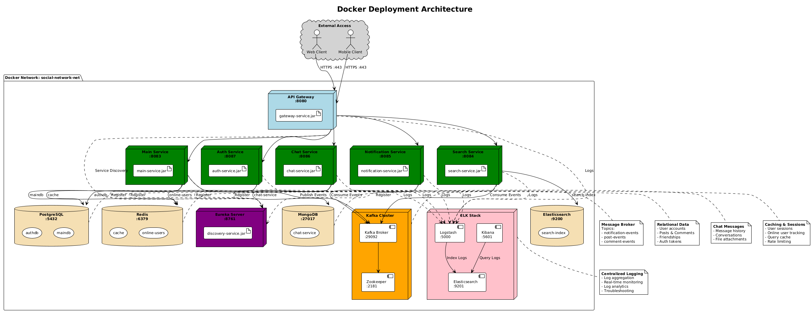

**Source**: [`diagrams/deployment-diagram.puml`](diagrams/deployment-diagram.puml)

Shows the Docker-based deployment architecture including network topology, service containers with port mappings, database containers, Kafka cluster with Zookeeper, and the ELK stack for centralized logging.

### Real-Time Communication Flow

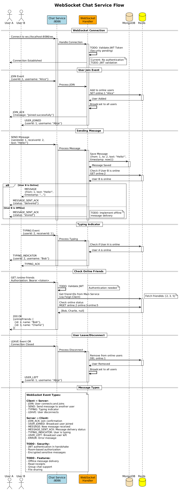

**Source**: [`diagrams/websocket-chat-flow.puml`](diagrams/websocket-chat-flow.puml)

Illustrates real-time chat communication via WebSocket, including event types (JOIN, SEND, TYPING, LEAVE), server responses (MESSAGE, USER_JOINED, USER_LEFT, TYPING_INDICATOR), online user tracking with Redis, and message delivery patterns.

### Component Architecture

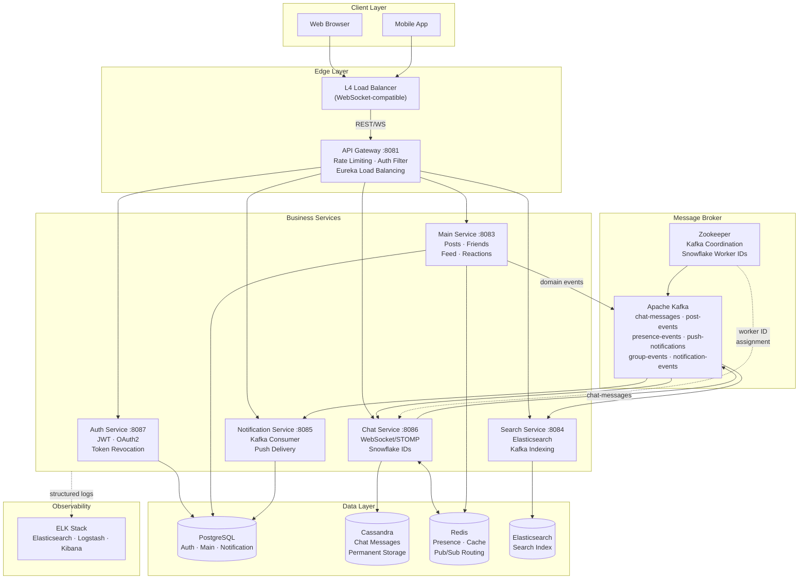
```mermaid
graph TB
    subgraph CLIENT["Client Layer"]
        WEB["Web Browser"]
        MOB["Mobile App"]
    end

    subgraph EDGE["Edge Layer"]
        LB["L4 Load Balancer\n(WebSocket-compatible)"]
        GW["API Gateway :8081\nRate Limiting · Auth Filter\nEureka Load Balancing"]
    end

    subgraph SERVICES["Business Services"]
        AUTH["Auth Service :8087\nJWT · OAuth2\nToken Revocation"]
        MAIN["Main Service :8083\nPosts · Friends\nFeed · Reactions"]
        CHAT["Chat Service :8086\nWebSocket/STOMP\nSnowflake IDs"]
        NOTIF["Notification Service :8085\nKafka Consumer\nPush Delivery"]
        SEARCH["Search Service :8084\nElasticsearch\nKafka Indexing"]
    end

    subgraph MESSAGING["Message Broker"]
        ZK["Zookeeper\nKafka Coordination\nSnowflake Worker IDs"]
        KAFKA["Apache Kafka\nchat-messages · post-events\npresence-events · push-notifications\ngroup-events · notification-events"]
    end

    subgraph DATA["Data Layer"]
        PG[("PostgreSQL\nAuth · Main · Notification")]
        CASS[("Cassandra\nChat Messages\nPermanent Storage")]
        REDIS[("Redis\nPresence · Cache\nPub/Sub Routing")]
        ES[("Elasticsearch\nSearch Index")]
    end

    subgraph OBS["Observability"]
        ELK["ELK Stack\nElasticsearch · Logstash · Kibana"]
    end

    WEB & MOB --> LB
    LB -->|"REST/WS"| GW
    GW --> AUTH & MAIN & CHAT & NOTIF & SEARCH

    MAIN -->|"domain events"| KAFKA
    CHAT -->|"chat-messages"| KAFKA
    KAFKA --> NOTIF & SEARCH & CHAT

    ZK --> KAFKA
    ZK -.->|"worker ID\nassignment"| CHAT

    AUTH --> PG
    MAIN --> PG
    NOTIF --> PG
    CHAT --> CASS
    CHAT <--> REDIS
    SEARCH --> ES
    MAIN --> REDIS

    SERVICES -.->|"structured logs"| ELK
```

### Scalable Chat Service — Internal Architecture

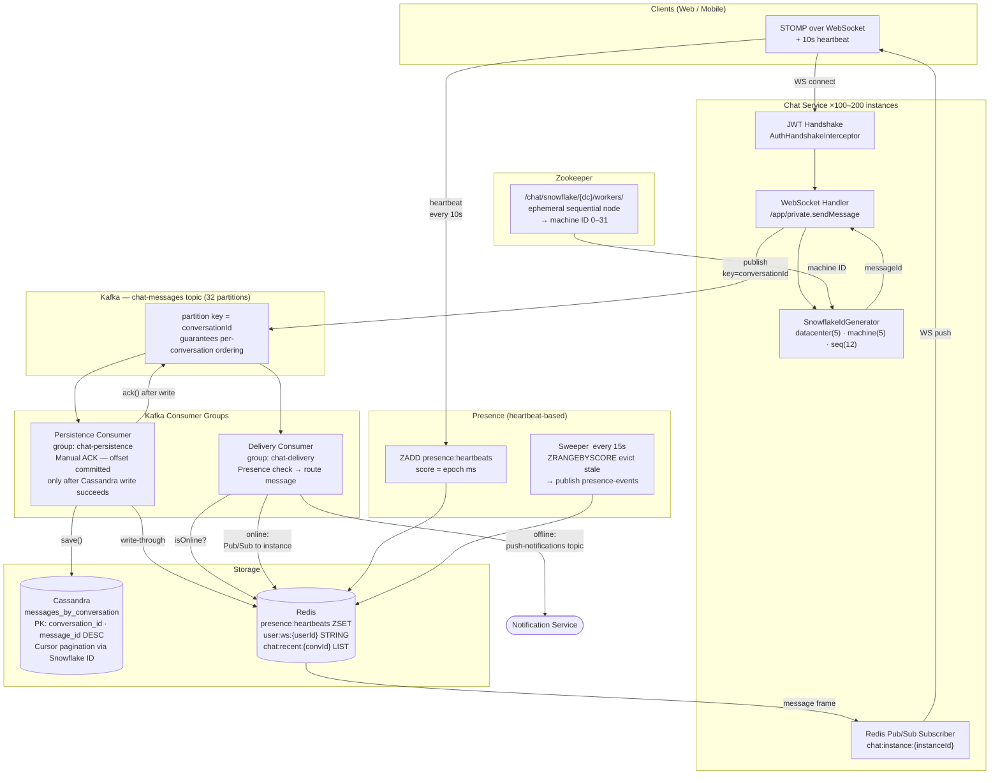
```mermaid
flowchart TD
    subgraph CLIENTS["Clients  (Web / Mobile)"]
        C["STOMP over WebSocket\n+ 10s heartbeat"]
    end

    subgraph CHATINSTANCES["Chat Service  ×100–200 instances"]
        AUTH_IC["JWT Handshake\nAuthHandshakeInterceptor"]
        WS["WebSocket Handler\n/app/private.sendMessage"]
        SNOW["SnowflakeIdGenerator\ndatacenter(5) · machine(5) · seq(12)"]
        SUB["Redis Pub/Sub Subscriber\nchat:instance:{instanceId}"]
    end

    subgraph ZK_BOX["Zookeeper"]
        ZK_NODE["/chat/snowflake/{dc}/workers/\nephemeral sequential node\n→ machine ID 0–31"]
    end

    subgraph KAFKA_BOX["Kafka  —  chat-messages topic  (32 partitions)"]
        PART["partition key = conversationId\nguarantees per-conversation ordering"]
    end

    subgraph CONSUMERS["Kafka Consumer Groups"]
        PERSIST["Persistence Consumer\ngroup: chat-persistence\nManual ACK — offset committed\nonly after Cassandra write succeeds"]
        DELIVER["Delivery Consumer\ngroup: chat-delivery\nPresence check → route message"]
    end

    subgraph STORAGE["Storage"]
        CASS[("Cassandra\nmessages_by_conversation\nPK: conversation_id · message_id DESC\nCursor pagination via Snowflake ID")]
        REDIS_S[("Redis\npresence:heartbeats  ZSET\nuser:ws:{userId}  STRING\nchat:recent:{convId}  LIST")]
    end

    subgraph PRESENCE["Presence  (heartbeat-based)"]
        HB["ZADD presence:heartbeats\nscore = epoch ms"]
        SWEEP["Sweeper  every 15s\nZRANGEBYSCORE evict stale\n→ publish presence-events"]
    end

    C -->|"WS connect"| AUTH_IC
    AUTH_IC --> WS
    WS --> SNOW
    ZK_NODE -->|"machine ID"| SNOW
    SNOW -->|"messageId"| WS
    WS -->|"publish\nkey=conversationId"| PART
    PART --> PERSIST & DELIVER

    PERSIST -->|"save()"| CASS
    PERSIST -->|"ack() after write"| PART
    PERSIST -->|"write-through"| REDIS_S

    DELIVER -->|"isOnline?"| REDIS_S
    DELIVER -->|"online:\nPub/Sub to instance"| REDIS_S
    REDIS_S -->|"message frame"| SUB
    SUB -->|"WS push"| C
    DELIVER -->|"offline:\npush-notifications topic"| NOTIF_SVC(["Notification Service"])

    C -->|"heartbeat\nevery 10s"| HB
    HB --> REDIS_S
    SWEEP --> REDIS_S
```

### News Feed Fanout System

Fanout-on-write architecture: events from posts, reactions, and comments are pushed into each friend's Redis sorted set immediately after the DB transaction commits. Reads are O(1) — a single `ZREVRANGEBYSCORE` on the pre-computed feed.

#### System Design Overview

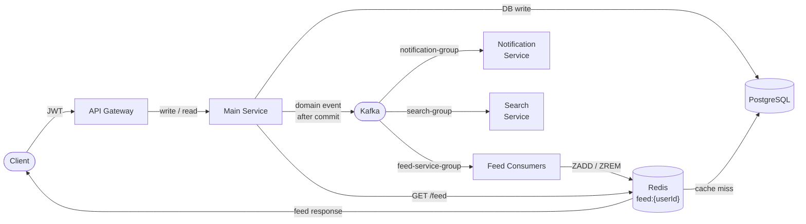
```mermaid
flowchart LR
    Client(["Client"])
    GW["API Gateway"]
    MS["Main Service"]
    Kafka(["Kafka"])
    FC["Feed Consumers"]
    NS["Notification\nService"]
    SS["Search\nService"]
    PG[("PostgreSQL")]
    REDIS[("Redis\nfeed:{userId}")]

    Client -->|JWT| GW
    GW -->|write / read| MS
    MS -->|DB write| PG
    MS -->|domain event\nafter commit| Kafka
    Kafka -->|feed-service-group| FC
    Kafka -->|notification-group| NS
    Kafka -->|search-group| SS
    FC -->|ZADD / ZREM| REDIS
    MS -->|GET /feed| REDIS
    REDIS -->|cache miss| PG
    REDIS -->|feed response| Client
```

#### Write Path — Three Fanout Triggers

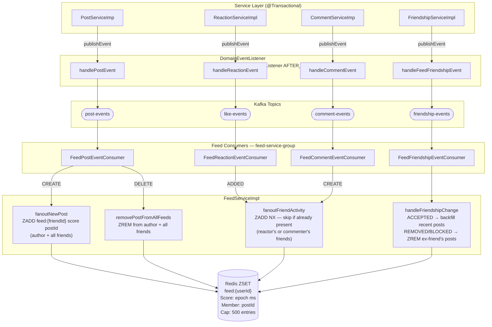
```mermaid
flowchart TD
    subgraph SVC["Service Layer (@Transactional)"]
        PS[PostServiceImp]
        RS[ReactionServiceImpl]
        CS[CommentServiceImp]
        FS[FriendshipServiceImpl]
    end

    subgraph DEL["DomainEventListener\n@TransactionalEventListener AFTER_COMMIT"]
        H1[handlePostEvent]
        H2[handleReactionEvent]
        H3[handleCommentEvent]
        H4[handleFeedFriendshipEvent]
    end

    subgraph KAFKA["Kafka Topics"]
        K1([post-events])
        K2([like-events])
        K3([comment-events])
        K4([friendship-events])
    end

    subgraph CONSUMERS["Feed Consumers — feed-service-group"]
        FC1[FeedPostEventConsumer]
        FC2[FeedReactionEventConsumer]
        FC3[FeedCommentEventConsumer]
        FC4[FeedFriendshipEventConsumer]
    end

    subgraph FANOUT["FeedServiceImpl"]
        FO1["fanoutNewPost\nZADD feed:{friendId} score postId\n(author + all friends)"]
        FO2["fanoutFriendActivity\nZADD NX — skip if already present\n(reactor's or commenter's friends)"]
        FO3["handleFriendshipChange\nACCEPTED → backfill recent posts\nREMOVED/BLOCKED → ZREM ex-friend's posts"]
        FO4["removePostFromAllFeeds\nZREM from author + all friends"]
    end

    REDIS[("Redis ZSET\nfeed:{userId}\nScore: epoch ms\nMember: postId\nCap: 500 entries")]

    PS -->|publishEvent| H1
    RS -->|publishEvent| H2
    CS -->|publishEvent| H3
    FS -->|publishEvent| H4

    H1 --> K1
    H2 --> K2
    H3 --> K3
    H4 --> K4

    K1 --> FC1
    K2 --> FC2
    K3 --> FC3
    K4 --> FC4

    FC1 -->|CREATE| FO1
    FC1 -->|DELETE| FO4
    FC2 -->|ADDED| FO2
    FC3 -->|CREATE| FO2
    FC4 --> FO3

    FO1 --> REDIS
    FO2 --> REDIS
    FO3 --> REDIS
    FO4 --> REDIS
```

#### Read Path — Cursor-Based Pagination

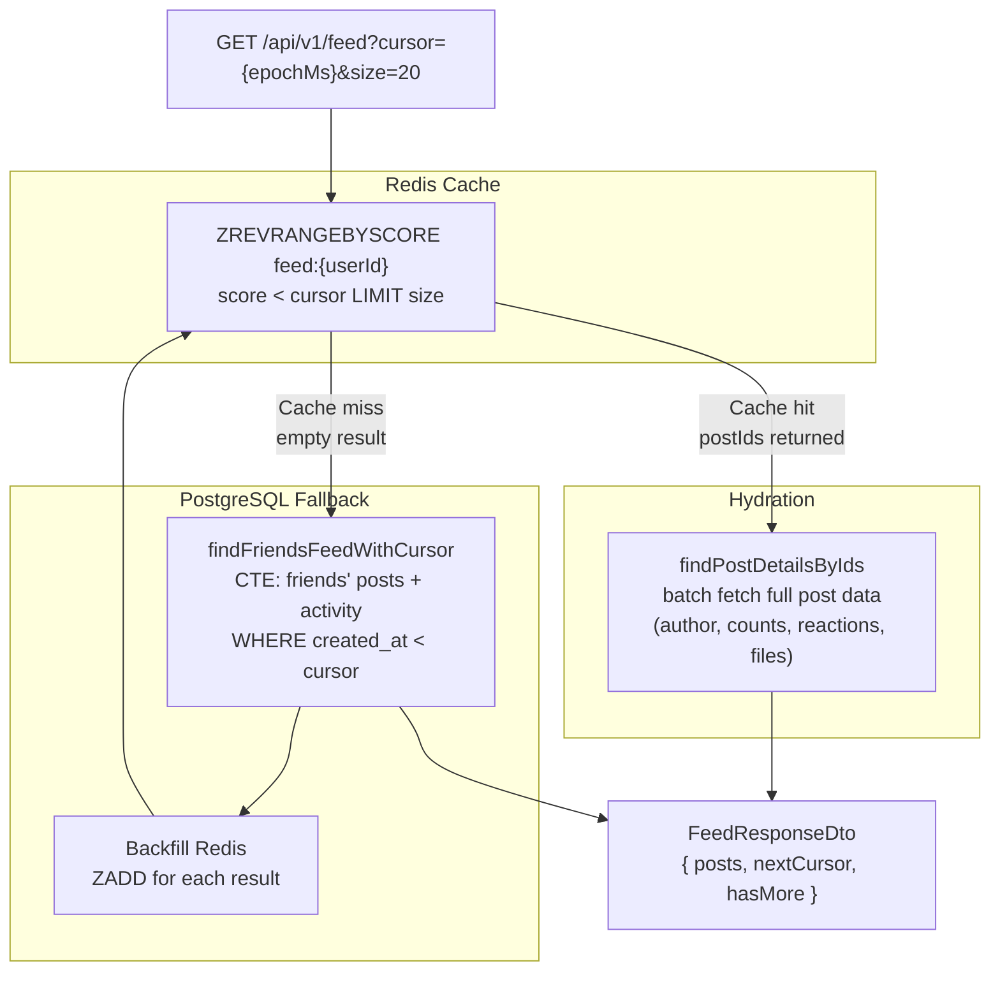
```mermaid
flowchart TD
    REQ["GET /api/v1/feed?cursor={epochMs}&size=20"]

    subgraph CACHE["Redis Cache"]
        ZREV["ZREVRANGEBYSCORE feed:{userId}\nscore < cursor LIMIT size"]
    end

    subgraph DB["PostgreSQL Fallback"]
        SQL["findFriendsFeedWithCursor\nCTE: friends' posts + activity\nWHERE created_at < cursor"]
        BACKFILL["Backfill Redis\nZADD for each result"]
    end

    subgraph HYDRATE["Hydration"]
        HYD["findPostDetailsByIds\nbatch fetch full post data\n(author, counts, reactions, files)"]
    end

    RESP["FeedResponseDto\n{ posts, nextCursor, hasMore }"]

    REQ --> ZREV
    ZREV -->|"Cache hit\npostIds returned"| HYD
    ZREV -->|"Cache miss\nempty result"| SQL
    SQL --> BACKFILL
    BACKFILL --> ZREV
    SQL --> RESP
    HYD --> RESP
```

#### Redis Data Structure

```
Key:    feed:{userId}          — one sorted set per user
Type:   ZSET
Score:  event timestamp (epoch milliseconds)
Member: postId (String)
Cap:    500 entries — ZREMRANGEBYRANK trims oldest on every write
```

**Key design decisions:**
- `ZADD NX` for reaction/comment fanout — post stays at original insertion time, not bumped on every new reaction
- `@TransactionalEventListener(AFTER_COMMIT)` — Kafka event fires only after DB commits, eliminating race conditions
- Cache miss falls back to PostgreSQL and backfills Redis automatically
- Cold start / LRU eviction transparent to the client

### Regenerating Diagrams

To regenerate PNG/SVG images from PlantUML source files:

```bash
cd diagrams
./generate-diagrams.sh
```

The script supports both PlantUML CLI and Docker-based generation. For detailed information, refer to [`diagrams/README.md`](diagrams/README.md).

## API Documentation

### Main Service API
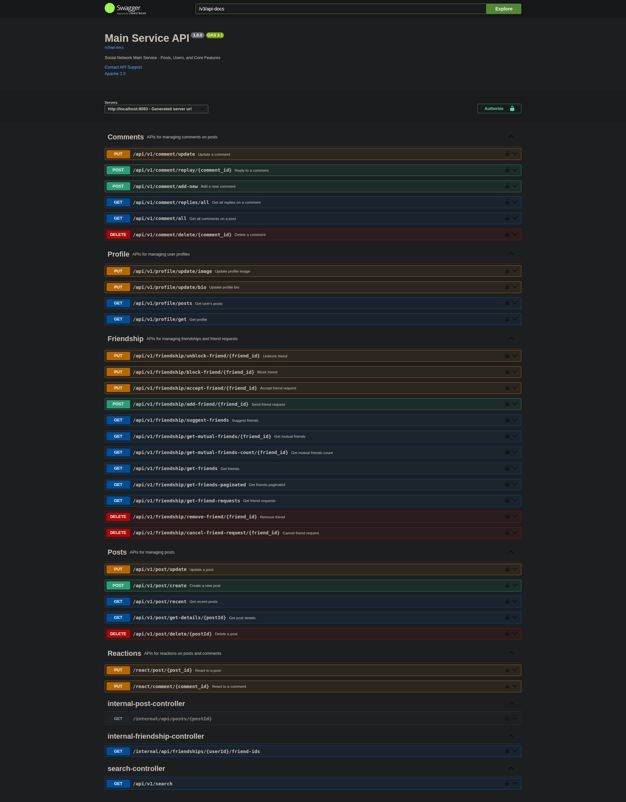

### Auth Service API
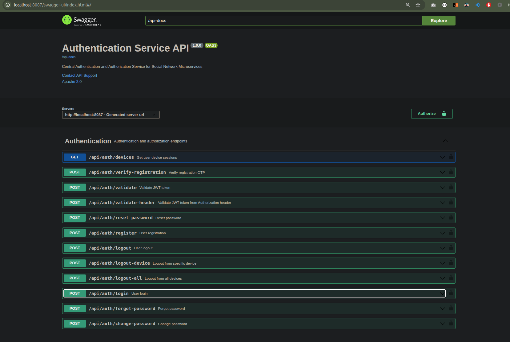

### notification Service API
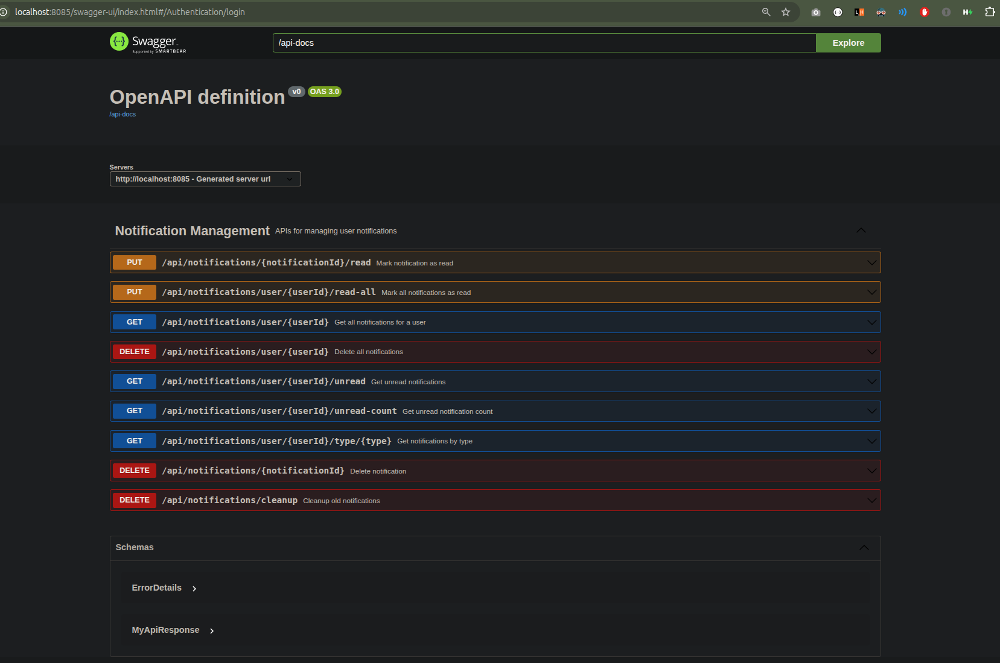

### Chat Service Client
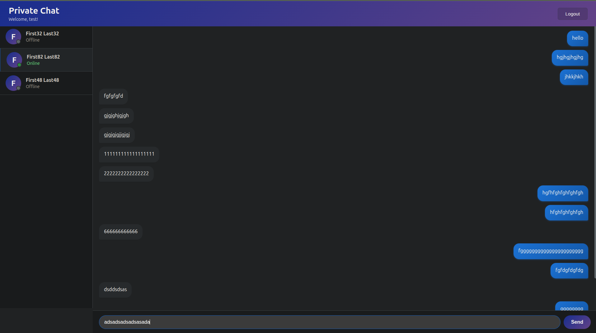

## Deployment Architecture

The platform uses Docker Compose for orchestration with a unified deployment file (`docker/docker-compose-all.yml`) that manages all infrastructure and microservices.

### Container Orchestration

**Network Architecture**:
- Single bridge network: `social_service_dev_network`
- All services communicate via service names (DNS resolution)
- Internal ports for inter-service communication
- Exposed ports for external access

**Service Dependencies**:
```
Infrastructure Layer (Foundation):
├── Databases: PostgreSQL (3 instances), MongoDB, Redis
├── Message Broker: Zookeeper → Kafka → Kafka UI
└── Search & Logging: Elasticsearch → Logstash/Kibana

Application Layer (Dependent on Infrastructure):
├── Auth Service (depends on: auth-db)
├── Main Service (depends on: main-db, kafka, auth-service)
├── Search Service (depends on: elasticsearch, kafka, auth-service)
├── Notification Service (depends on: notification-db, kafka, auth-service)
├── Chat Service (depends on: redis, auth-service)
└── Gateway Service (depends on: auth-service)
```

**Health Checks**:
- Databases: `pg_isready`, `redis-cli ping`, `mongosh ping`
- Kafka: Broker API version check
- Elasticsearch: Cluster health endpoint
- Services: Port listening check or custom health endpoints

**Resource Allocation** (per service):

| Service | CPU Limit | Memory Limit | Reserved Memory |
|---------|-----------|--------------|-----------------|
| **Infrastructure** |
| Zookeeper | 0.25 cores | 256MB | 128MB |
| Kafka | 0.5 cores | 512MB | 256MB |
| Elasticsearch | 0.5 cores | 640MB | 384MB |
| Logstash | 0.25 cores | 384MB | 128MB |
| Kibana | 0.25 cores | 512MB | 384MB |
| Redis | 0.25 cores | 192MB | 64MB |
| PostgreSQL (each) | 0.25-0.5 cores | 256-384MB | 128-256MB |
| **Microservices** |
| Auth Service | 0.5 cores | 320MB | 192MB |
| Gateway Service | 0.5 cores | 320MB | 192MB |
| Main Service | 0.5 cores | 448MB | 256MB |
| Search Service | 0.5 cores | 320MB | 192MB |
| Notification Service | 0.25 cores | 256MB | 128MB |
| Chat Service | 0.5 cores | 320MB | 192MB |

**Total System Requirements**: ~5.5 GB RAM, ~6 CPU cores (recommended 8GB RAM, 4+ cores)

**Persistent Volumes**:
- `kafka-data`: Kafka message persistence
- `elasticsearch_data`: Search index storage
- `kibana_data`: Kibana configuration
- `auth-db-data`, `main-db-data`, `notification-db-data`: PostgreSQL data
- `cassandra-data`: Cassandra chat message storage
- `main-service-uploads`: User-uploaded files

### Build Strategy

**Multi-Layer Dockerfile Pattern**:
1. **Layer 1 (POM files)**: Parent + shared/security-lib + service pom.xml
2. **Layer 2 (Dependencies)**: `mvn dependency:go-offline` - cached until pom.xml changes
3. **Layer 3 (Source code)**: Application code - changes frequently
4. **Layer 4 (Build)**: Maven build - reuses cached dependencies

**Independent Microservice Builds**:
- Each service builds standalone (no Maven reactor)
- Security-lib built first, then service
- No cross-service dependencies in Dockerfiles

**Performance**:
- Code changes: 30-60 seconds (dependencies cached)
- Dependency changes: 5-10 minutes (full rebuild)

### Deployment Files

**Main Orchestration**:
- `docker/docker-compose-all.yml`: All services + infrastructure
- Single command deployment: `docker-compose -f docker-compose-all.yml up -d`

**Individual Components** (for development):
- `docker/docker-compose-kafka.yml`: Kafka stack only
- `docker/elk-stack-docker/docker-compose-elk.yml`: ELK stack only
- `services/*/docker/dev/docker-compose.yml`: Individual service files

## Project Structure
```plaintext
.
├── docker
│   ├── docker-compose-all.yml          # Main deployment file (all services)
│   └── elk-stack-docker
│       └── logstash.conf
├── shared
│   └── security-lib                    # Shared authentication library
│       ├── pom.xml
│       └── src
└── services
    ├── auth-service
    │   ├── Dockerfile
    │   └── src
    ├── chat-service
    │   ├── docker/dev/Dockerfile
    │   └── src
    ├── discovery-service
    │   ├── docker/dev/Dockerfile
    │   └── src
    ├── gateway-service
    │   ├── docker/dev/Dockerfile
    │   └── src
    ├── main-service
    │   ├── docker/dev/Dockerfile
    │   └── src
    ├── notification-service
    │   ├── docker/dev/Dockerfile
    │   └── src
    └── search-service
        ├── docker/dev/Dockerfile
        └── src
```
## Getting Started

### Prerequisites

- Docker and Docker Compose (v20.10+)
- Java 17 or higher (for local development)
- Maven 3.6 or higher (for local development)
- Minimum 8GB RAM for running all services
- `.env` file in project root (see `.env.examples` for template)

### Docker Deployment (Recommended)

The entire platform can be deployed using a single Docker Compose file that orchestrates all infrastructure and microservices.

#### Quick Start - All Services

```bash
# Clone the repository
git clone <repository-url>
cd social-network-microservices

# Create .env file from template
cp .env.examples .env
# Edit .env file with your configuration

# Build and start all services
cd docker
docker-compose -f docker-compose-all.yml up -d

# View logs
docker-compose -f docker-compose-all.yml logs -f

# Check service status
docker-compose -f docker-compose-all.yml ps
```

The `docker-compose-all.yml` includes:
- **Infrastructure**: Zookeeper, Kafka, Kafka UI, Elasticsearch, Logstash, Kibana, Redis, PostgreSQL (3 instances), MongoDB
- **Microservices**: auth-service, gateway-service, main-service, search-service, notification-service, chat-service

#### Service Startup Order

Services start in dependency order with health checks:
1. Databases (PostgreSQL, MongoDB, Redis)
2. Message broker (Zookeeper → Kafka)
3. Search & logging (Elasticsearch → Logstash/Kibana)
4. Auth service (authentication foundation)
5. Business services (main, search, notification, chat)
6. Gateway service (API routing)

**First-time startup**: Allow 5-10 minutes for all services to initialize and become healthy.

#### Rebuild After Code Changes

Docker layer caching ensures fast rebuilds when you modify code:

```bash
# Rebuild specific service (recommended for code changes)
docker-compose -f docker-compose-all.yml build <service-name>
docker-compose -f docker-compose-all.yml up -d <service-name>

# Example: Rebuild main-service after code changes
docker-compose -f docker-compose-all.yml build main-service
docker-compose -f docker-compose-all.yml up -d main-service

# Rebuild all services (if dependencies changed in pom.xml)
docker-compose -f docker-compose-all.yml build

# Rebuild without cache (force fresh build)
docker-compose -f docker-compose-all.yml build --no-cache
```

**Build Performance**:
- Code-only changes: ~30-60 seconds per service (Maven dependencies cached)
- POM changes: ~5-10 minutes per service (dependencies re-downloaded)

#### Stop and Cleanup

```bash
# Stop all services
docker-compose -f docker-compose-all.yml down

# Stop and remove volumes (WARNING: deletes all data)
docker-compose -f docker-compose-all.yml down -v

# View resource usage
docker-compose -f docker-compose-all.yml stats
```

### Alternative: Individual Service Deployment

For development or testing individual services:

```bash
# Start infrastructure only
cd docker
docker-compose -f docker-compose-kafka.yml up -d
docker-compose -f elk-stack-docker/docker-compose-elk.yml up -d

# Run specific service locally (requires Java 17 + Maven)
cd services/main-service
mvn spring-boot:run
```

### Local Development (No Docker)

```bash
# Install and start required infrastructure:
# - PostgreSQL (ports 5432, 5433, 5434, 5435)
# - MongoDB (port 27017)
# - Kafka (port 29092)
# - Elasticsearch (port 9200)
# - Redis (port 6379)

# Build shared security library (required by all services)
cd shared/security-lib
mvn clean install

# Run any service
cd services/main-service
mvn spring-boot:run -Dspring-boot.run.arguments=--spring.profiles.active=dev
```

### Service Endpoints

Once running, the following endpoints are available:

**Microservices**:
- Auth Service: `http://localhost:8087` - [Swagger](http://localhost:8087/swagger-ui.html)
- Gateway Service: `http://localhost:8081` - API routing with authentication filtering
- Main Service: `http://localhost:8082` (via gateway) / `http://localhost:8083` (direct) - [Swagger](http://localhost:8083/swagger-ui.html)
- Search Service: `http://localhost:8084` - [Swagger](http://localhost:8084/swagger-ui.html)
- Notification Service: `http://localhost:8085` - [Swagger](http://localhost:8085/swagger-ui.html)
- Chat Service: `http://localhost:8086` - WebSocket: `ws://localhost:8086/ws`

**Infrastructure**:
- Kafka: `localhost:29092` (host) / `kafka:9092` (container)
- Kafka UI: `http://localhost:9093`
- Elasticsearch: `http://localhost:9200`
- Kibana: `http://localhost:5601`
- Redis: `localhost:6379`
- PostgreSQL DBs: `localhost:5433` (auth), `5434` (main), `5435` (notification)

### API Testing Examples

Register a new user:
```bash
curl -X POST http://localhost:8083/api/auth/signup \
  -H "Content-Type: application/json" \
  -d '{"username":"testuser","email":"test@test.com","password":"password123"}'
```

User login:
```bash
curl -X POST http://localhost:8083/api/auth/signin \
  -H "Content-Type: application/json" \
  -d '{"username":"testuser","password":"password123"}'
```

### Troubleshooting

#### Service Won't Start

**Problem**: Service fails with "Connection refused" or "Unknown host"
```bash
# Check if infrastructure services are healthy
docker-compose -f docker-compose-all.yml ps

# View service logs
docker-compose -f docker-compose-all.yml logs <service-name>

# Restart specific service
docker-compose -f docker-compose-all.yml restart <service-name>
```

**Problem**: Gateway service circular dependency error
```
The dependencies of some of the beans in the application context form a cycle
```
**Solution**: Already fixed with `@Lazy` annotation in AuthenticationGatewayFilterFactory. Rebuild gateway-service:
```bash
docker-compose -f docker-compose-all.yml build gateway-service
docker-compose -f docker-compose-all.yml up -d gateway-service
```

**Problem**: Elasticsearch fails with "max virtual memory areas too low"
```bash
# Linux/macOS
sudo sysctl -w vm.max_map_count=262144

# Docker Desktop (Windows/macOS): Increase Docker memory to at least 4GB in settings
```

#### Build Issues

**Problem**: Maven build fails with "Child module does not exist"
```bash
# Ensure you're using the latest Dockerfiles with independent builds
cd docker
docker-compose -f docker-compose-all.yml build --no-cache
```

**Problem**: Slow Docker builds
```bash
# Verify dependency caching is working
docker-compose -f docker-compose-all.yml build <service-name>
# Should show "CACHED" for dependency layers if only code changed

# Clear Docker build cache if needed
docker builder prune -a
```

#### Database Connection Issues

**Problem**: "Connection to database failed"
```bash
# Check if database is healthy
docker-compose -f docker-compose-all.yml ps | grep db

# Verify database credentials in .env file match docker-compose-all.yml
cat ../.env

# Restart database
docker-compose -f docker-compose-all.yml restart auth-db main-db notification-db
```

#### Port Conflicts

**Problem**: "Port already in use"
```bash
# Find what's using the port
sudo lsof -i :<port-number>

# Kill the process or change the port in docker-compose-all.yml
```

#### Memory Issues

**Problem**: Services crash or become unresponsive
```bash
# Check resource usage
docker stats

# Increase Docker memory limit:
# Docker Desktop: Preferences → Resources → Memory (set to at least 8GB)

# Reduce service memory limits in docker-compose-all.yml if needed
```

#### Kafka Connection Issues

**Problem**: "Could not connect to Kafka broker"
```bash
# Verify Kafka is healthy
docker-compose -f docker-compose-all.yml logs kafka

# Check Kafka UI
open http://localhost:9093

# Restart Kafka stack
docker-compose -f docker-compose-all.yml restart zookeeper kafka
```

## Development Roadmap

### Current Status

**Production Ready**
- User authentication and authorization
- **OAuth2 social login** (Google, Facebook, GitHub)
- Core social features (posts, comments, friendships)
- Full-text search integration
- Event-driven notifications
- Real-time chat with WebSocket security
- Multi-device session management
- OTP verification system
- Service discovery and registration
- API gateway routing
- Complete Docker orchestration
- ELK stack centralized logging

**Planned**
- Redis caching
- Enhanced monitoring and observability
- CI/CD pipeline
- Comprehensive test coverage

### Known Limitations

- Redis caching layer not yet integrated (infrastructure ready)
- S3-compatible storage (MinIO) pending for file uploads

## Contributing

This project is under active development. Contributions, issues, and feature requests are welcome.

## License

This project is licensed under the MIT License.
