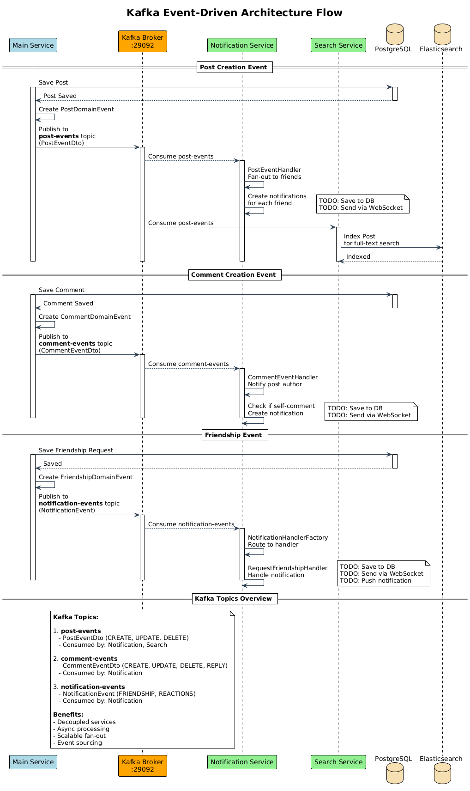

# Social Network Microservices Platform

A scalable microservice-based social network backend system built with Spring Boot, featuring event-driven architecture, real-time communication, and distributed data management. This platform demonstrates modern enterprise patterns including service discovery, API gateway routing, message-driven systems, and comprehensive observability.

**Development Status**: This project is under active development. Core services are functional, while infrastructure components are being progressively enhanced.

**Last Updated**: November 2025

## Features

### Core Functionality
- User authentication and authorization with JWT token management
- User profile management with support for bio, skills, and profile pictures
- Post creation and management with full CRUD operations
- Comment system with nested comment support
- Friendship system including friend requests, mutual friends, and friend suggestions
- Full-text search powered by Elasticsearch
- Event-driven notification system using Apache Kafka
- Real-time chat functionality via WebSocket with online user tracking
- Comprehensive API documentation via Swagger/OpenAPI
- Containerized deployment using Docker

### Security & Infrastructure
- JWT-based stateless authentication with token revocation
- Centralized authentication service with Feign client integration
- Gateway-level and service-level security filters
- Role-based access control across all services
- Centralized logging with ELK stack (Elasticsearch, Logstash, Kibana)
- Multi-database architecture (PostgreSQL, MongoDB, Elasticsearch)

### In Progress
- Service discovery with Eureka (infrastructure in place)
- API Gateway routing with Spring Cloud Gateway
- Redis-based caching and rate limiting
- Complete Docker Compose orchestration
- WebSocket security enhancements

## Architecture Overview

The system follows a microservices architecture pattern with each service having a specific responsibility. Services communicate through both synchronous REST APIs and asynchronous event-driven messaging via Apache Kafka. The platform is designed to be horizontally scalable, fault-tolerant, and maintainable.

### Service Topology

**Production Services**
- **Auth Service** (Port: 8087) - Centralized authentication and JWT token management
- **Main Service** (Port: 8083) - Core business logic including posts, comments, and friendships
- **Search Service** - Full-text search powered by Elasticsearch with Kafka-based indexing
- **Notification Service** - Event-driven notification system consuming Kafka topics
- **Chat Service** (Port: 8084) - Real-time messaging via WebSocket with MongoDB persistence

**Infrastructure Services**
- **Gateway Service** - API routing and load balancing (in development)
- **Discovery Service** - Eureka-based service registry (in development)

All services are containerized using Docker and can be orchestrated via Docker Compose for both development and production environments.

## Technology Stack

**Core Framework**
- Java 17
- Spring Boot 3.x
- Spring Cloud
- Spring Security with JWT

**Data Management**
- PostgreSQL - Primary relational database for:
  - Auth Service: User credentials, JWT tokens, revocation tracking
  - Main Service: User data, posts, comments, friendships, reactions
  - Notification Service: Notification history, read/unread status, delivery tracking
- MongoDB - Document store for chat messages
- Elasticsearch - Full-text search engine for content discovery
- Redis - Caching and session management (infrastructure ready)

**Communication & Messaging**
- Apache Kafka - Event streaming and inter-service messaging
- WebSocket - Real-time bidirectional communication for chat
- OpenFeign - Declarative REST client for inter-service calls

**DevOps & Observability**
- Docker - Container platform
- Docker Compose - Multi-container orchestration
- ELK Stack (Elasticsearch, Logstash, Kibana) - Centralized logging and monitoring
- Swagger/OpenAPI - API documentation
- Maven - Build automation

## Service Details & Status

### Auth Service (Port: 8087)
**Status**: Fully functional with pending optimizations
- Centralized authentication and authorization
- JWT token generation and validation
- Token revocation tracking in PostgreSQL database
- Multi-device logout support
- User registration and login with Spring Security
- Feign client integration for inter-service communication
- OTP functionality with email verification
- Swagger documentation available at `/swagger-ui.html`
- **TODO**: Migrate token storage to Redis for improved performance
- **TODO**: Implement rate limiting for authentication endpoints
- **TODO**: Add Redis-based session management
- **TODO**: Implement distributed rate limiting across service instances

### Main Service (Port: 8083)
**Status**: Fully functional
- User authentication and registration with JWT tokens
- Profile management including bio, skills, and profile picture
- Post management with full CRUD operations
- Reaction system for posts (like, love, etc.)
- Comment management with support for nested comments
- Comment reply functionality
- Comment reactions
- Friendship system featuring requests, mutual friends, and friend suggestions
- File upload handling for user content(File System storage currently).
- Swagger documentation available at `/swagger-ui.html`
- **TODO**: create Profile automatically when user registers.
- **TODO**: create indexes in postgreSQL for performance optimization (create index on foreign keys to speed up joins)
- **TODO**: Implement Redis caching for frequently accessed data (user data).
- **TODO**: Add rate limiting for critical endpoints
- **TODO**: Implement soft deletes for posts and comments
- **TODO**: Add content moderation features (e.g., reporting, filtering)
- **TODO**: Implement analytics for user engagement
- **TODO**: Integrate with Prometheus and Grafana for metrics monitoring
- **TODO**: Implement CI/CD pipeline for automated testing and deployment
- **TODO**: Add integration tests for critical workflows
- **TODO**: Implement database migration strategy (e.g., Flyway or Liquibase)
- **TODO**: SetUp S3 Compatible storage for file uploads(MinIO) instead of local storage.

### Chat Service (WebSocket)
**Status**: Basic functionality implemented, security pending
- WebSocket server setup complete
- Authorize WebSocket connections using Jwt tokens in http Only Cookies.
- MongoDB integration for message persistence
- Online user tracking with join and leave events
- Real-time message sending and receiving
- Typing indicators and user presence notifications
- get friends paginated.
- chat privately between two users.
- Fetch chat history between users
- **TODO**: Offline message storage
- **TODO**: Api Documentation with Swagger
- **TODO**: ensure that frontend works as expected.

### Search Service
**Status**: Integrated with Elasticsearch
- Full-text search capabilities across the platform
- Kafka integration for automatic content indexing
- Search functionality across posts and user profiles

### Notification Service (Port: 8085)
**Status**: Fully functional with PostgreSQL persistence
- PostgreSQL database for notification storage and history
- Kafka producer and consumer setup complete
- Event-driven notification system consuming Kafka topics
- Multi-service communication established
- REST API for retrieving, marking read, and managing notifications
- Notification persistence with read/unread status tracking
- Paginated notification retrieval by user, type, and read status
- Database indexing on receiver_id, read status, and timestamps for performance
- Automated cleanup of old read notifications
- Swagger documentation available at `/swagger-ui.html`
- **TODO**: Implement notification delivery mechanisms (email, push notifications)
- **TODO**: User preferences for notification settings
- **TODO**: Real-time notification delivery via WebSocket
- **TODO**: Implement retry mechanisms for failed notifications
- **TODO**: Analytics for notification engagement
- **TODO**: Rate limiting for notification sending

### Discovery Service (Eureka)
**Status**: Service created but not integrated
- Basic Eureka server setup complete
- **TODO**: Client registration from other services
- **TODO**: Load balancing configuration

### Gateway Service (Spring Cloud Gateway)
**Status**: Skeleton created
- Basic gateway structure in place
- **TODO**: Route configuration
- **TODO**: Security integration
- **TODO**: Load balancing setup

### Centralized Logging (ELK Stack)
**Status**: ELK stack deployed via Docker
- Logstash configured to collect logs from all services
- Kibana dashboard setup for log visualization
- **TODO**: Fine-tune log parsing and indexing
- **TODO**: Implement alerting based on log patterns
- **TODO**: Integrate with Prometheus and Grafana for metrics monitoring
- **TODO**: Set up log retention policies
- 
## Authentication Flow

The system uses a **centralized authentication** approach with JWT tokens managed by a dedicated Auth Service.

### Architecture Components
- **Auth Service** (Port: 8087): Centralized authentication and token validation
- **Gateway Service**: Entry point with authentication filtering
- **Shared Security Library**: Reusable authentication components across microservices
- **Feign Client**: Inter-service communication for token validation

### Flow Diagrams

#### 1. User Login Flow
```
Client → Gateway → Auth Service
1. User sends credentials (email/password) to POST /api/auth/login
2. Auth Service validates credentials via Spring Security AuthenticationManager
3. Generates JWT access token + refresh token
4. Stores token in database for revocation tracking
5. Updates user's last login timestamp
6. Returns AuthResponse with tokens and user info
```

#### 2. Request Authentication (via API Gateway)
```
Client → Gateway → Auth Service → Downstream Service
1. Client includes header: Authorization: Bearer <token>
2. Gateway filter (AuthenticationGatewayFilterFactory) intercepts all requests
3. Calls Auth Service via Feign Client to validate token
4. Auth Service validates:
   - Token expiration
   - Token revocation status in database
   - JWT signature and claims
5. If valid:
   - Gateway adds user context headers:
     * X-User-Id: User's ID
     * X-User-Email: User's email
     * X-User-Roles: Comma-separated roles
   - Forwards request to downstream service
6. If invalid: Returns 401 Unauthorized
```

#### 3. Service-Level Authentication
```
Request → Service Filter → Controller
1. JwtAuthenticationFilter (from shared-security-lib) intercepts requests
2. Calls Auth Service via Feign Client to validate token
3. If valid:
   - Creates Spring Security authentication object
   - Sets SecurityContext with user details and roles
   - Request proceeds to controller
4. If invalid: Returns 401 with error message
```

#### 4. Token Validation (Auth Service)
```
Service → Auth Service /api/auth/validate-header
1. Checks token expiration date
2. Queries database for token revocation status
3. Extracts username from JWT claims
4. Validates token signature
5. Loads user details from database
6. Returns TokenValidationResponse:
   - isValid: true/false
   - userId, email, roles (if valid)
   - error message (if invalid)
```

#### 5. Logout Flow
```
Single Device Logout:
1. Client sends POST /api/auth/logout with token
2. Auth Service marks specific token as expired/revoked in database

All Devices Logout:
1. Client sends POST /api/auth/logout-all?userId=<id>
2. Auth Service revokes all tokens for the user
```

### What is Feign Client?

**Feign Client** is a **declarative HTTP client** from Spring Cloud that simplifies inter-service communication.

**Location**: `shared/security-lib/src/main/java/com/app/shared/security/client/AuthServiceClient.java`

```java
@FeignClient(name = "auth-service", url = "${auth-service.url:http://localhost:8087}", path = "/api/auth")
public interface AuthServiceClient {
    @PostMapping("/validate-header")
    TokenValidationResponse validateToken(@RequestHeader("Authorization") String authHeader);
}
```

**Benefits**:
- **No manual HTTP client code**: Auto-generates RestTemplate/WebClient code
- **Type-safe**: Returns deserialized Java objects
- **Centralized configuration**: All services call auth-service using same interface
- **Used by**: Gateway Service, Main Service, Chat Service, and all other microservices

**How it works**:
1. Define interface with HTTP annotations (@PostMapping, @RequestHeader, etc.)
2. Feign generates implementation at runtime
3. Makes actual HTTP call to auth-service
4. Deserializes JSON response to `TokenValidationResponse`

### Security Features Implemented
- Centralized authentication service
- JWT-based stateless authentication
- Token revocation tracking in database
- Gateway-level authentication filtering
- Service-level security filters
- Role-based access control (RBAC)
- Multi-device logout support
- Token expiration validation

## Architecture Diagrams

The system architecture is documented using PlantUML diagrams, providing visual representations of service interactions, data flows, and deployment topology. All diagram source files are located in the `diagrams/` directory and can be viewed using the PlantUML Web Server, VS Code PlantUML extension, or IntelliJ IDEA PlantUML plugin.

### System Architecture Diagram


**Source**: [`diagrams/microservices-architecture.puml`](diagrams/microservices-architecture.puml)

This diagram illustrates the complete microservices ecosystem including all services, databases, message brokers, and communication patterns. It shows the topology of seven microservices with their respective ports, the multi-database architecture (PostgreSQL, MongoDB, Elasticsearch, Redis), Kafka event-driven messaging, Eureka service discovery, ELK stack for centralized logging, and gateway-based routing.

### Event-Driven Architecture



**Source**: [`diagrams/kafka-event-flow.puml`](diagrams/kafka-event-flow.puml)

Demonstrates event-driven communication patterns using Apache Kafka. The system uses three primary topics: `post-events` for post lifecycle events, `comment-events` for comment operations, and `notification-events` for friendship and reaction events. This architecture enables automatic content indexing in Elasticsearch and fan-out notifications to connected users.

### Authentication Architecture


**Source**: [`diagrams/authentication-flow.puml`](diagrams/authentication-flow.puml)

Details the JWT-based authentication system with centralized token management. The flow covers user login, token validation at both gateway and service levels, inter-service authentication via Feign clients, and multi-device logout capabilities.

### Deployment Topology


**Source**: [`diagrams/deployment-diagram.puml`](diagrams/deployment-diagram.puml)

Shows the Docker-based deployment architecture including network topology, service containers with port mappings, database containers, Kafka cluster with Zookeeper, and the ELK stack for centralized logging.

### Real-Time Communication Flow


**Source**: [`diagrams/websocket-chat-flow.puml`](diagrams/websocket-chat-flow.puml)

Illustrates real-time chat communication via WebSocket, including event types (JOIN, SEND, TYPING, LEAVE), server responses (MESSAGE, USER_JOINED, USER_LEFT, TYPING_INDICATOR), online user tracking with Redis, and message delivery patterns.

### Component Architecture


**Source**: [`diagrams/system-components.puml`](diagrams/system-components.puml)

Provides a layered view of system components across frontend (Web, Mobile, Admin), edge services (Gateway, Load Balancer), business services (Auth, Main, Chat, Notification, Search), data access layer (PostgreSQL, MongoDB, Elasticsearch, Redis), message broker (Kafka), and monitoring infrastructure (ELK, Prometheus, Grafana).

### Regenerating Diagrams

To regenerate PNG/SVG images from PlantUML source files:

```bash
cd diagrams
./generate-diagrams.sh
```

The script supports both PlantUML CLI and Docker-based generation. For detailed information, refer to [`diagrams/README.md`](diagrams/README.md).

## API Documentation

### Main Service API


### Auth Service API


### notification Service API


### Chat Service Client


## Project Structure
```plaintext
.
├── docker
│   ├── docker-compose-kafka.yml
│   ├── docker-dev-entrypoint.sh
│   └── elk-stack-docker
│       ├── docker-compose-elk.yml
│       └── logstash.conf
├── docker-compose-dev.yaml
├── docker-compose-prod.yaml
└── services
    ├── chat-service
    │   ├── docker
    │   │   └── dev
    │   │       ├── docker-compose.yml
    │   │       └── Dockerfile
    ├── discovery-service
    │   ├── docker
    │   │   └── dev
    │   │       ├── docker-compose.yml
    │   │       └── Dockerfile
    ├── gateway-service
    │   ├── docker
    │   │   └── dev
    │   │       ├── docker-compose.yml
    │   │       └── Dockerfile
    ├── main-service
    │   ├── docker
    │   │   ├── dev
    │   │   │   ├── docker-compose.yaml
    │   │   │   ├── Dockerfile.dev
    │   │   │   └── Dockerfile.dev.psql
    │   │   └── production
    │   │       ├── docker-compose-app-production.yaml
    │   │       ├── Dockerfile.production
    │   │       └── Dockerfile.production.psql
    ├── notification-service
    │   ├── docker
    │   │   └── dev
    │   │       ├── docker-compose.yml
    │   │       └── Dockerfile
    └── search-service
        ├── docker
        │   └── dev
        │       ├── docker-compose.yml
        │       └── Dockerfile

```
## Getting Started

### Prerequisites

- Docker and Docker Compose (v20.10+)
- Java 17 or higher (for local development)
- Maven 3.6 or higher (for local development)
- Minimum 8GB RAM for running all services
- `.env` file in project root (see `.env.examples` for template)

### Docker Deployment (Recommended)

The entire platform can be deployed using a single Docker Compose file that orchestrates all infrastructure and microservices.

#### Quick Start - All Services

```bash
# Clone the repository
git clone <repository-url>
cd social-network-microservices

# Create .env file from template
cp .env.examples .env
# Edit .env file with your configuration

# Build and start all services
cd docker
docker-compose -f docker-compose-all.yml up -d

# View logs
docker-compose -f docker-compose-all.yml logs -f

# Check service status
docker-compose -f docker-compose-all.yml ps
```

The `docker-compose-all.yml` includes:
- **Infrastructure**: Zookeeper, Kafka, Kafka UI, Elasticsearch, Logstash, Kibana, Redis, PostgreSQL (3 instances), MongoDB
- **Microservices**: auth-service, gateway-service, main-service, search-service, notification-service, chat-service

#### Service Startup Order

Services start in dependency order with health checks:
1. Databases (PostgreSQL, MongoDB, Redis)
2. Message broker (Zookeeper → Kafka)
3. Search & logging (Elasticsearch → Logstash/Kibana)
4. Auth service (authentication foundation)
5. Business services (main, search, notification, chat)
6. Gateway service (API routing)

**First-time startup**: Allow 5-10 minutes for all services to initialize and become healthy.

#### Rebuild After Code Changes

Docker layer caching ensures fast rebuilds when you modify code:

```bash
# Rebuild specific service (recommended for code changes)
docker-compose -f docker-compose-all.yml build <service-name>
docker-compose -f docker-compose-all.yml up -d <service-name>

# Example: Rebuild main-service after code changes
docker-compose -f docker-compose-all.yml build main-service
docker-compose -f docker-compose-all.yml up -d main-service

# Rebuild all services (if dependencies changed in pom.xml)
docker-compose -f docker-compose-all.yml build

# Rebuild without cache (force fresh build)
docker-compose -f docker-compose-all.yml build --no-cache
```

**Build Performance**:
- Code-only changes: ~30-60 seconds per service (Maven dependencies cached)
- POM changes: ~5-10 minutes per service (dependencies re-downloaded)

#### Stop and Cleanup

```bash
# Stop all services
docker-compose -f docker-compose-all.yml down

# Stop and remove volumes (WARNING: deletes all data)
docker-compose -f docker-compose-all.yml down -v

# View resource usage
docker-compose -f docker-compose-all.yml stats
```

### Alternative: Individual Service Deployment

For development or testing individual services:

```bash
# Start infrastructure only
cd docker
docker-compose -f docker-compose-kafka.yml up -d
docker-compose -f elk-stack-docker/docker-compose-elk.yml up -d

# Run specific service locally (requires Java 17 + Maven)
cd services/main-service
mvn spring-boot:run
```

### Local Development (No Docker)

```bash
# Install and start required infrastructure:
# - PostgreSQL (ports 5432, 5433, 5434, 5435)
# - MongoDB (port 27017)
# - Kafka (port 29092)
# - Elasticsearch (port 9200)
# - Redis (port 6379)

# Build shared security library (required by all services)
cd shared/security-lib
mvn clean install

# Run any service
cd services/main-service
mvn spring-boot:run -Dspring-boot.run.arguments=--spring.profiles.active=dev
```

### Service Endpoints

Once running, the following endpoints are available:

**Microservices**:
- Auth Service: `http://localhost:8087` - [Swagger](http://localhost:8087/swagger-ui.html)
- Gateway Service: `http://localhost:8081` - API routing (in development)
- Main Service: `http://localhost:8082` (internal) / `http://localhost:8083` (direct) - [Swagger](http://localhost:8083/swagger-ui.html)
- Search Service: `http://localhost:8084` - [Swagger](http://localhost:8084/swagger-ui.html)
- Notification Service: `http://localhost:8085` - [Swagger](http://localhost:8085/swagger-ui.html)
- Chat Service: `http://localhost:8086` - WebSocket: `ws://localhost:8086/ws`

**Infrastructure**:
- Kafka: `localhost:29092` (host) / `kafka:9092` (container)
- Kafka UI: `http://localhost:9093`
- Elasticsearch: `http://localhost:9200`
- Kibana: `http://localhost:5601`
- Redis: `localhost:6379`
- PostgreSQL DBs: `localhost:5433` (auth), `5434` (main), `5435` (notification)

### API Testing Examples

Register a new user:
```bash
curl -X POST http://localhost:8083/api/auth/signup \
  -H "Content-Type: application/json" \
  -d '{"username":"testuser","email":"test@test.com","password":"password123"}'
```

User login:
```bash
curl -X POST http://localhost:8083/api/auth/signin \
  -H "Content-Type: application/json" \
  -d '{"username":"testuser","password":"password123"}'
```

### Troubleshooting

#### Service Won't Start

**Problem**: Service fails with "Connection refused" or "Unknown host"
```bash
# Check if infrastructure services are healthy
docker-compose -f docker-compose-all.yml ps

# View service logs
docker-compose -f docker-compose-all.yml logs <service-name>

# Restart specific service
docker-compose -f docker-compose-all.yml restart <service-name>
```

**Problem**: Gateway service circular dependency error
```
The dependencies of some of the beans in the application context form a cycle
```
**Solution**: Already fixed with `@Lazy` annotation in AuthenticationGatewayFilterFactory. Rebuild gateway-service:
```bash
docker-compose -f docker-compose-all.yml build gateway-service
docker-compose -f docker-compose-all.yml up -d gateway-service
```

**Problem**: Elasticsearch fails with "max virtual memory areas too low"
```bash
# Linux/macOS
sudo sysctl -w vm.max_map_count=262144

# Docker Desktop (Windows/macOS): Increase Docker memory to at least 4GB in settings
```

#### Build Issues

**Problem**: Maven build fails with "Child module does not exist"
```bash
# Ensure you're using the latest Dockerfiles with independent builds
cd docker
docker-compose -f docker-compose-all.yml build --no-cache
```

**Problem**: Slow Docker builds
```bash
# Verify dependency caching is working
docker-compose -f docker-compose-all.yml build <service-name>
# Should show "CACHED" for dependency layers if only code changed

# Clear Docker build cache if needed
docker builder prune -a
```

#### Database Connection Issues

**Problem**: "Connection to database failed"
```bash
# Check if database is healthy
docker-compose -f docker-compose-all.yml ps | grep db

# Verify database credentials in .env file match docker-compose-all.yml
cat ../.env

# Restart database
docker-compose -f docker-compose-all.yml restart auth-db main-db notification-db
```

#### Port Conflicts

**Problem**: "Port already in use"
```bash
# Find what's using the port
sudo lsof -i :<port-number>

# Kill the process or change the port in docker-compose-all.yml
```

#### Memory Issues

**Problem**: Services crash or become unresponsive
```bash
# Check resource usage
docker stats

# Increase Docker memory limit:
# Docker Desktop: Preferences → Resources → Memory (set to at least 8GB)

# Reduce service memory limits in docker-compose-all.yml if needed
```

#### Kafka Connection Issues

**Problem**: "Could not connect to Kafka broker"
```bash
# Verify Kafka is healthy
docker-compose -f docker-compose-all.yml logs kafka

# Check Kafka UI
open http://localhost:9093

# Restart Kafka stack
docker-compose -f docker-compose-all.yml restart zookeeper kafka
```

## Development Roadmap

### Current Status

**Production Ready**
- User authentication and authorization
- Core social features (posts, comments, friendships)
- Full-text search integration
- Event-driven notifications
- Basic real-time chat

**In Development**
- Service discovery and registration
- API gateway routing
- WebSocket security
- Complete Docker orchestration

**Planned**
- Redis caching and rate limiting
- Enhanced monitoring and observability
- CI/CD pipeline
- Comprehensive test coverage

### Known Limitations

- Service discovery integration with Eureka requires completion
- Gateway service route configuration needs completion
- ELK stack integration needs configuration refinement
- Redis caching layer not yet integrated (infrastructure ready)

## Contributing

This project is under active development. Contributions, issues, and feature requests are welcome.

## License

This project is licensed under the MIT License.
